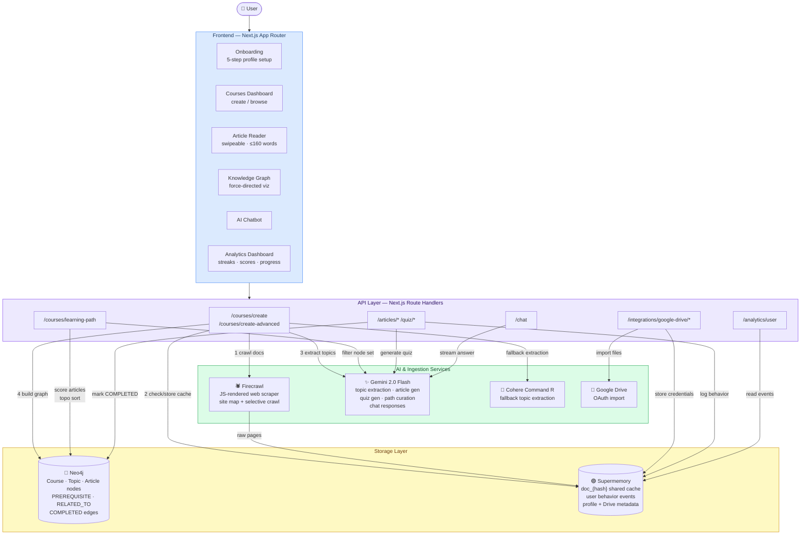

# Docuer

**Turn any documentation URL or Google Drive file into a personalized, bite-sized learning course — powered by AI and a live knowledge graph.**

---

## Overview

Docuer is a full-stack Next.js application that eliminates the "reading docs is a slog" problem. Point it at any documentation site or Google Drive document, and it automatically:

1. Crawls and caches the content
2. Extracts a topic hierarchy with Gemini 2.0 Flash
3. Generates ≤160-word articles tailored to your experience level and goals
4. Persists the relationships in Neo4j as a navigable knowledge graph
5. Sequences the articles into a personalized learning path with prerequisite enforcement

The result is a TikTok-style swipeable reader backed by a real graph database — not just a reformatted docs page.

---

## Preview

**[Watch the demo on YouTube](https://www.youtube.com/watch?v=6zUn6MzgsFU)** | **[Devpost submission](https://devpost.com/software/docuer)**

[](https://www.youtube.com/watch?v=6zUn6MzgsFU)

Logo: [`public/images/logo.png`](public/images/logo.png)

---

## Highlights

- **Graph-native learning paths** — Neo4j stores topic/article nodes with `PREREQUISITE`, `RELATED_TO`, and `COMPLETED` edges; learning paths are generated via weighted Cypher queries (35% difficulty match, 25% interest alignment, 25% goal alignment, 15% importance) and topological sort.
- **Intelligent deduplication** — Documentation is hashed on the source URL and stored once in Supermemory; every user who creates a course from the same URL reuses the cached content, eliminating redundant API calls.
- **Two-phase selective crawling** — In advanced mode, Firecrawl maps the site, Gemini scores each page against the user's profile, and the user cherry-picks before the full crawl begins — saving time and API budget on large documentation sites.
- **Personalization at every layer** — A 5-step onboarding captures experience level, learning goals, interests, and time commitment; Gemini uses this profile when generating articles, selecting learning path nodes, and pre-filtering pages.
- **Auto-wired knowledge graph** — Gemini produces semantic relationships (prerequisites, related topics, importance scores); dangling nodes are automatically connected so the graph is always fully traversable.
- **Built-in rate-limit management** — A sliding-window queue enforces ≤9 Gemini requests/minute with automatic back-pressure, preventing 429 errors during bulk article generation.

---

## Use Cases

| Use Case | User | Outcome |
|---|---|---|
| Learn a new framework fast | Developer onboarding a new stack | Personalized course from official docs in minutes |
| Turn internal docs into training | Team lead or educator | Bite-sized lessons from Google Drive documents |
| Structured self-study | Student or career-changer | Prerequisite-ordered learning path with quizzes |
| Explore an unfamiliar codebase | Engineer reading architecture docs | Knowledge graph shows topic relationships visually |

---

## Features

### Course Creation
- **Simple mode** — Enter a URL, Firecrawl crawls all pages automatically
- **Advanced mode** — Two-phase crawl: AI pre-selects relevant pages per your profile; you confirm before processing
- **Google Drive import** — OAuth connection; browse, select, and import documents directly

### Learning Experience
- Swipeable article reader (≤160 words per card, ~45-second reads)
- Auto-generated quizzes — 3 questions per article at easy / medium / hard difficulty with explanations
- AI chatbot for in-context questions and concept clarification
- Prerequisite locking — articles unlock only after dependencies are completed

### Knowledge Graph
- Interactive force-directed graph (react-force-graph-2d)
- Color-coded nodes by difficulty and completion state
- Fullscreen exploration mode
- Clickable nodes navigate directly to the article

### Analytics & Progress
- Completion percentage, learning streaks, quiz scores
- Behavioral tracking (views, completions, time spent) stored in Supermemory
- Preferred topic and struggle area detection

---

## Tech Stack

| Layer | Technology | Purpose |
|---|---|---|
| Framework | Next.js 16 (App Router) | Full-stack routing and API routes |
| UI | React 19 + HeroUI + Tailwind CSS 4 | Component library and styling |
| Animation | Framer Motion | Page transitions and micro-interactions |
| State | Zustand 5 (localStorage persistence) | Client-side course and user state |
| Graph visualization | react-force-graph-2d | Interactive knowledge graph rendering |
| Markdown | react-markdown | Article content rendering |
| AI content | Google Gemini 2.0 Flash | Article gen, topic extraction, quiz gen, path curation |
| Web scraping | Firecrawl | JS-rendered docs crawling and site mapping |
| Knowledge graph DB | Neo4j (AuraDB or local) | Topic/article nodes and learning relationships |
| Memory & analytics | Supermemory | Content caching, user behavior tracking |
| Fallback AI | Cohere Command R | Backup topic extraction |
| Types | TypeScript 5 + Zod | End-to-end type safety and validation |

---

## Architecture



---

## How It Works

1. **Onboarding** — User sets experience level, goals, interests, and weekly time commitment (stored in Supermemory user profile).
2. **Course creation** — A documentation URL is hashed; if the hash matches a Supermemory container, cached content is reused. Otherwise Firecrawl crawls the site and stores pages in the shared container.
3. **Topic extraction** — Gemini analyzes cached content and returns a JSON topic hierarchy with prerequisites, related topics, importance scores (0–1), and difficulty tiers.
4. **Article generation** — For each topic, Gemini generates a personalized ≤160-word article. Complexity, examples, and tone are adjusted based on the user's profile fetched from Supermemory.
5. **Graph construction** — Neo4j stores `Course`, `Topic`, and `Article` nodes. Prerequisite and `RELATED_TO` relationships are created from the Gemini output; dangling nodes are auto-connected.
6. **Learning path** — A Cypher query scores articles by profile relevance and topological ordering; Gemini can further filter the node set to 40–70% of total articles for focus.
7. **Progress tracking** — Completing an article creates a `COMPLETED` edge in Neo4j and logs a behavior event in Supermemory for analytics aggregation.

---

## Setup

### Prerequisites

- Node.js ≥ 20
- A Neo4j instance (AuraDB free tier or local Docker)
- API keys: Gemini, Firecrawl, Supermemory (Cohere is optional)

### Install

```bash
git clone <repository-url>
cd docuer
npm install
```

### Environment Variables

Create a `.env.local` file in the project root:

```env
# Web scraping
FIRECRAWL_API_KEY=your_firecrawl_api_key

# AI content generation (required)
GEMINI_API_KEY=your_gemini_api_key

# Knowledge graph
NEO4J_URI=neo4j+s://your-instance.neo4j.io
NEO4J_USERNAME=neo4j
NEO4J_PASSWORD=your_neo4j_password

# Memory and behavior tracking
SUPERMEMORY_API_KEY=your_supermemory_api_key
SUPERMEMORY_BASE_URL=https://api.supermemory.ai

# Optional fallback AI
COHERE_API_KEY=your_cohere_api_key
```

**Where to get keys:**
| Service | Free Tier | Link |
|---|---|---|
| Firecrawl | 500 credits/month | firecrawl.dev |
| Google Gemini | 1,500 req/day (Flash) | aistudio.google.com/apikey |
| Neo4j AuraDB | 200k nodes / 50MB | neo4j.com/cloud/aura-free |
| Supermemory | Check current pricing | supermemory.ai |

### Neo4j: Docker (local)

```bash
docker run --name neo4j \
  -p 7474:7474 -p 7687:7687 \
  -e NEO4J_AUTH=neo4j/your_password \
  neo4j:latest
```

Then set `NEO4J_URI=neo4j://localhost:7687` in `.env.local`. Indexes and constraints are created automatically on first run.

### Run

```bash
npm run dev        # http://localhost:3000
npm run build
npm run start
```

### Lint / Format

```bash
npm run lint
npm run format
```

---

## Usage

### Create a course (Simple mode)

1. Log in (demo accounts: `Alice` — beginner, `Bob` — advanced)
2. Complete the 5-step onboarding
3. Go to **Courses → Create New Course**
4. Enter a documentation URL (e.g., `https://docs.python.org`)
5. Wait for crawl → topic extraction → article generation → graph build

### Create a course (Advanced mode)

1. Click **Create Advanced Course**
2. Enter URL — Gemini maps the site and pre-selects pages matching your profile
3. Review and adjust the selection
4. Click **Create Course with Selected Pages**

### Google Drive import

1. Click **Google Drive** in the sidebar
2. Authenticate via OAuth
3. Browse and select documents
4. Create a course from the selected files

### Learning

- Swipe or navigate through ≤160-word articles
- Click the graph icon to explore topic relationships
- Take auto-generated quizzes to unlock progress tracking
- Open the chatbot for instant concept clarification

---

## Key Decisions

| Decision | Rationale | Tradeoff |
|---|---|---|
| Neo4j for learning graph | Cypher makes prerequisite traversal and weighted scoring natural; graph models learning relationships directly | Adds operational complexity and a required external service |
| Hash-based Supermemory containers | Multiple users learning from the same docs share one cached copy, cutting crawl costs | Cache invalidation is not yet implemented; stale docs require manual re-crawl |
| Gemini 2.0 Flash as sole AI engine | Consolidates provider surface, simplifies prompt management, and leverages a fast model at low cost | Hard rate limit of 9 req/min; bulk course creation queues and waits |
| ≤160-word article format | Optimized for mobile reading; forces each article to cover exactly one concept | Depth is sacrificed for brevity; complex topics may feel incomplete |
| Two-phase crawling | Prevents over-crawling large doc sites; gives users transparency and control | Adds a step before course creation |
| Zustand with localStorage | Zero-backend state for course/article data keeps the app fast and offline-friendly | State is per-browser; multi-device sync is not supported |

---

## Technical Deep Dives

### Neo4j Knowledge Graph Schema

**Node types:**
| Node | Key Properties |
|---|---|
| `Course` | `id`, `name`, `description`, `sourceUrl`, `createdAt` |
| `Topic` | `id`, `name`, `category`, `importance` (0–1), `difficulty` |
| `Article` | `id`, `title`, `content`, `order`, `difficulty`, `estimatedTime`, `keywords` |
| `User` | `id`, `username`, `level`, `goals`, `interests` |

**Relationship types:**
| Relationship | Direction | Meaning |
|---|---|---|
| `CONTAINS` | Course→Topic, Topic→Article | Structural ownership |
| `PREREQUISITE` | Topic→Topic, Article→Article | Must be learned first |
| `RELATED_TO` | Topic↔Topic | Shares concepts (weighted 0–1) |
| `ENABLES` | Auto-created reverse of `PREREQUISITE` | For reverse traversal |
| `COMPLETED` | User→Article | Stamped with timestamp, score, timeSpent |

**Learning path scoring (Cypher pseudocode):**
```
score = (
  0.35 × difficultyMatch(article.difficulty, user.level)
+ 0.25 × interestMatch(article.keywords, user.interests)
+ 0.25 × goalMatch(article.category, user.goals)
+ 0.15 × article.importance
)
// Ordered by topological sort over PREREQUISITE edges
```

---

### Supermemory Container Strategy

```
doc_{hash(url)}              ← shared across all users for same documentation URL
user_{userId}                ← user profile, preferences, behavior
user_{userId}_course_{id}    ← per-course progress and notes
user_{userId}_gdrive_{id}    ← Google Drive connection metadata
```

This means the first user to process `https://docs.python.org` pays the crawl and storage cost; every subsequent user reads from the shared container — no redundant API calls.

---

### Data Flow: Course Creation

```
User Input (URL)
  ↓
Firecrawl — crawl all pages / site-map for two-phase mode
  ↓
Supermemory — cache content in shared doc_{hash} container
  ↓
Gemini 2.0 Flash — extract topic hierarchy (5–15 topics, prerequisites, importance, difficulty)
  ↓
Gemini 2.0 Flash — generate ≤160-word personalized article per topic (profiled to user)
  ↓
Neo4j — create Course/Topic/Article nodes + PREREQUISITE / RELATED_TO edges
  ↓
Zustand Store — hydrate client state
  ↓
UI — course ready
```

### Data Flow: Learning Path Generation

```
User Profile (level, interests, goals)
  ↓
Neo4j — score articles by relevance (Cypher weighted query)
  ↓
Gemini — optionally filter to 40–70% of articles based on profile
  ↓
Topological sort over PREREQUISITE graph
  ↓
Ordered article sequence → UI
```

### Data Flow: Progress Tracking

```
User completes article or quiz
  ↓
Neo4j — create COMPLETED edge (timestamp, score, timeSpent)
  ↓
Supermemory — log behavior event (viewed / completed / quiz_taken)
  ↓
Analytics aggregation from both sources
  ↓
Dashboard — completion %, streaks, quiz scores, preferred topics, struggle areas
```

---

## Innovation / Notable Work

- **Profile-conditioned prompting across the full pipeline** — The user's level, interests, and goals flow from onboarding through Supermemory into every Gemini call: page filtering, topic extraction, article generation, and learning path curation. Most doc-to-course tools apply a single transformation; Docuer personalizes each layer.
- **Semantic graph construction via LLM** — Rather than relying on structural heuristics (heading depth, link proximity), Gemini infers semantic prerequisites and concept overlap from content meaning. The result is a graph that can surface non-obvious relationships (e.g., "State Variables → State" as a specialization, not just a sibling).
- **Shared content cache with zero redundancy** — The SHA-based Supermemory container key means the first user to process a documentation URL pays the crawl cost; all subsequent users for the same URL read from cache. This is architecturally simple but meaningfully cost-efficient at scale.
- **Topological prerequisite enforcement** — Article ordering in the learning path is not just a ranking; it is a topological sort over the directed prerequisite graph, guaranteeing that no article appears before its dependencies.

---

## About

Docuer was built to solve the friction of learning from raw documentation. The core thesis: documentation is structured knowledge, and a graph database is the right primitive for representing it — not a flat list of pages or a search index. The combination of a graph-native data model, LLM-driven semantic extraction, and per-user personalization is what separates this from a documentation formatter.

> **Note on authentication:** The current version uses prototype authentication with demo accounts. It is not production-ready. See `lib/services/auth.ts` for the replacement points.
