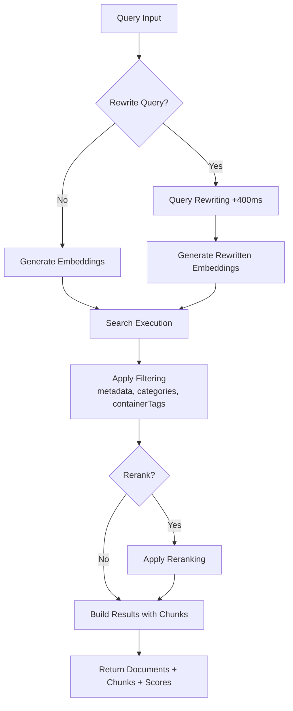
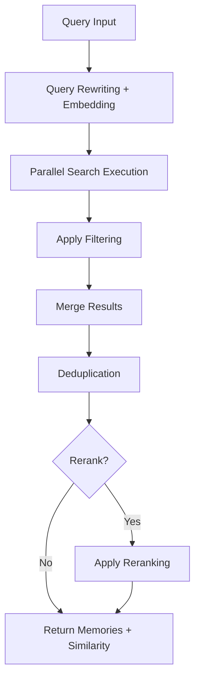

# Memory vs RAG: Understanding the Difference

> Learn why agent memory and RAG are fundamentally different, and when to use each approach

Most developers confuse RAG (Retrieval-Augmented Generation) with agent memory. They're not the same thing, and using RAG for memory is why your agents keep forgetting important context. Let's understand the fundamental difference.

## The Core Problem

When building AI agents, developers often treat memory as just another retrieval problem. They store conversations in a vector database, embed queries, and hope semantic search will surface the right context.

**This approach fails because memory isn't about finding similar text—it's about understanding relationships, temporal context, and user state over time.**

## Documents vs Memories in Supermemory

Supermemory makes a clear distinction between these two concepts:

### Documents: Raw Knowledge

Documents are the raw content you send to Supermemory—PDFs, web pages, text files. They represent static knowledge that doesn't change based on who's accessing it.

**Characteristics:**

- **Stateless**: A document about Python programming is the same for everyone
- **Unversioned**: Content doesn't track changes over time
- **Universal**: Not linked to specific users or entities
- **Searchable**: Perfect for semantic similarity search

**Use Cases:**

- Company knowledge bases
- Technical documentation
- Research papers
- General reference material

### Memories: Contextual Understanding

Memories are the insights, preferences, and relationships extracted from documents and conversations. They're tied to specific users or entities and evolve over time.

**Characteristics:**

- **Stateful**: "User prefers dark mode" is specific to that user
- **Temporal**: Tracks when facts became true or invalid
- **Personal**: Linked to users, sessions, or entities
- **Relational**: Understands connections between facts

**Use Cases:**

- User preferences and history
- Conversation context
- Personal facts and relationships
- Behavioral patterns

## Why RAG Fails as Memory

Let's look at a real scenario that illustrates the problem:

<Tabs>
  <Tab title="The Scenario">
    ```
    Day 1: "I love Adidas sneakers"
    Day 30: "My Adidas broke after a month, terrible quality"
    Day 31: "I'm switching to Puma"
    Day 45: "What sneakers should I buy?"
    ```
  </Tab>

  <Tab title="RAG Approach (Wrong)">
    ```python  theme={null}
    # RAG sees these as isolated embeddings
    query = "What sneakers should I buy?"

    # Semantic search finds closest match
    result = vector_search(query)
    # Returns: "I love Adidas sneakers" (highest similarity)

    # Agent recommends Adidas 🤦
    ```

    **Problem**: RAG finds the most semantically similar text but misses the temporal progression and causal relationships.

  </Tab>

  <Tab title="Memory Approach (Right)">
    ```python  theme={null}
    # Supermemory understands temporal context
    query = "What sneakers should I buy?"

    # Memory retrieval considers:
    # 1. Temporal validity (Adidas preference is outdated)
    # 2. Causal relationships (broke → disappointment → switch)
    # 3. Current state (now prefers Puma)

    # Agent correctly recommends Puma ✅
    ```

    **Solution**: Memory systems track when facts become invalid and understand causal chains.

  </Tab>
</Tabs>

## The Technical Difference

### RAG: Semantic Similarity

```
Query → Embedding → Vector Search → Top-K Results → LLM
```

RAG excels at finding information that's semantically similar to your query. It's stateless—each query is independent.

### Memory: Contextual Graph

```
Query → Entity Recognition → Graph Traversal → Temporal Filtering → Context Assembly → LLM
```

Memory systems build a knowledge graph that understands:

- **Entities**: Users, products, concepts
- **Relationships**: Preferences, ownership, causality
- **Temporal Context**: When facts were true
- **Invalidation**: When facts became outdated

## When to Use Each

<CardGroup cols={2}>
  <Card title="Use RAG For" icon="search">
    * Static documentation
    * Knowledge bases
    * Research queries
    * General Q\&A
    * Content that doesn't change per user
  </Card>

  <Card title="Use Memory For" icon="brain">
    * User preferences
    * Conversation history
    * Personal facts
    * Behavioral patterns
    * Anything that evolves over time
  </Card>
</CardGroup>

## Real-World Examples

### E-commerce Assistant

<Tabs>
  <Tab title="RAG Component">
    Stores product catalogs, specifications, reviews

    ```python  theme={null}
    # Good for RAG
    "What are the specs of iPhone 15?"
    "Compare Nike and Adidas running shoes"
    "Show me waterproof jackets"
    ```

  </Tab>

  <Tab title="Memory Component">
    Tracks user preferences, purchase history, interactions

    ```python  theme={null}
    # Needs Memory
    "What size do I usually wear?"
    "Did I like my last purchase?"
    "What's my budget preference?"
    ```

  </Tab>
</Tabs>

### Customer Support Bot

<Tabs>
  <Tab title="RAG Component">
    FAQ documents, troubleshooting guides, policies

    ```python  theme={null}
    # Good for RAG
    "How do I reset my password?"
    "What's your return policy?"
    "Troubleshooting WiFi issues"
    ```

  </Tab>

  <Tab title="Memory Component">
    Previous issues, user account details, conversation context

    ```python  theme={null}
    # Needs Memory
    "Is my issue from last week resolved?"
    "What plan am I on?"
    "You were helping me with..."
    ```

  </Tab>
</Tabs>

## How Supermemory Handles Both

Supermemory provides a unified platform that correctly handles both patterns:

### 1. Document Storage (RAG)

```python theme={null}
# Add a document for RAG-style retrieval
client.memories.add(
    content="iPhone 15 has a 48MP camera and A17 Pro chip",
    # No user association - universal knowledge
)
```

### 2. Memory Creation

```python theme={null}
# Add a user-specific memory
client.memories.add(
    content="User prefers Android over iOS",
    container_tags=["user_123"],  # User-specific
    metadata={
        "type": "preference",
        "confidence": "high"
    }
)
```

### 3. Hybrid Retrieval

```python theme={null}
# Search combines both approaches
results = client.memories.search(
    query="What phone should I recommend?",
    container_tags=["user_123"],  # Gets user memories
    # Also searches general knowledge
)

# Results include:
# - User's Android preference (memory)
# - Latest Android phone specs (documents)
```

## The Bottom Line

<Note>
  **Key Insight**: RAG answers "What do I know?" while Memory answers "What do I remember about you?"
</Note>

Stop treating memory like a retrieval problem. Your agents need both:

- **RAG** for accessing knowledge
- **Memory** for understanding users

Supermemory provides both capabilities in a unified platform, ensuring your agents have the right context at the right time.

# Google Drive Connector

> Connect Google Drive to sync documents into your Supermemory knowledge base

Connect Google Drive to sync documents into your Supermemory knowledge base with OAuth authentication and custom app support.

## Quick Setup

### 1. Create Google Drive Connection

<Tabs>
  <Tab title="TypeScript">
    ```typescript  theme={null}
    import Supermemory from 'supermemory';

    const client = new Supermemory({
      apiKey: process.env.SUPERMEMORY_API_KEY!
    });

    const connection = await client.connections.create('google-drive', {
      redirectUrl: 'https://yourapp.com/auth/google-drive/callback',
      containerTags: ['user-123', 'gdrive-sync'],
      documentLimit: 3000,
      metadata: {
        source: 'google-drive',
        department: 'engineering'
      }
    });

    // Redirect user to Google OAuth
    window.location.href = connection.authLink;
    console.log('Auth expires in:', connection.expiresIn);
    ```

  </Tab>

  <Tab title="Python">
    ```python  theme={null}
    from supermemory import Supermemory
    import os

    client = Supermemory(api_key=os.environ.get("SUPERMEMORY_API_KEY"))

    connection = client.connections.create(
        'google-drive',
        redirect_url='https://yourapp.com/auth/google-drive/callback',
        container_tags=['user-123', 'gdrive-sync'],
        document_limit=3000,
        metadata={
            'source': 'google-drive',
            'department': 'engineering'
        }
    )

    # Redirect user to Google OAuth
    print(f'Redirect to: {connection.auth_link}')
    print(f'Expires in: {connection.expires_in}')
    ```

  </Tab>

  <Tab title="cURL">
    ```bash  theme={null}
    curl -X POST "https://api.supermemory.ai/v3/connections/google-drive" \
      -H "Authorization: Bearer $SUPERMEMORY_API_KEY" \
      -H "Content-Type: application/json" \
      -d '{
        "redirectUrl": "https://yourapp.com/auth/google-drive/callback",
        "containerTags": ["user-123", "gdrive-sync"],
        "documentLimit": 3000,
        "metadata": {
          "source": "google-drive",
          "department": "engineering"
        }
      }'
    ```
  </Tab>
</Tabs>

### 2. Handle OAuth Callback

After user grants permissions, Google redirects to your callback URL. The connection is automatically established.

### 3. Check Connection Status

<Tabs>
  <Tab title="TypeScript">
    ```typescript  theme={null}
    // Get connection details
    const connection = await client.connections.getByTags('google-drive', {
      containerTags: ['user-123', 'gdrive-sync']
    });
    ```
  </Tab>

  <Tab title="Python">
    ```python  theme={null}
    # Get connection details
    connection = client.connections.get_by_tags(
        'google-drive',
        container_tags=['user-123', 'gdrive-sync']
    )

    # List synced documents
    documents = client.connections.list_documents(
        'google-drive',
        container_tags=['user-123', 'gdrive-sync']
    )
    ```

  </Tab>

  <Tab title="cURL">
    ```bash  theme={null}
    # Get connections by provider and tags
    curl -X POST "https://api.supermemory.ai/v3/connections/list" \
      -H "Authorization: Bearer $SUPERMEMORY_API_KEY" \
      -H "Content-Type: application/json" \
      -d '{
        "containerTags": ["user-123", "gdrive-sync"],
        "provider": "google-drive"
      }'

    # List synced documents
    curl -X POST "https://api.supermemory.ai/v3/documents/list" \
      -H "Authorization: Bearer $SUPERMEMORY_API_KEY" \
      -H "Content-Type: application/json" \
      -d '{
        "containerTags": ["user-123", "gdrive-sync"],
        "source": "google-drive"
      }'
    ```

  </Tab>
</Tabs>

## Supported Document Types

Based on the API type definitions, Google Drive documents are identified with these types:

- `google_doc` - Google Docs
- `google_slide` - Google Slides
- `google_sheet` - Google Sheets

## Connection Management

### List All Connections

<Tabs>
  <Tab title="TypeScript">
    ```typescript  theme={null}
    // List all connections for specific container tags
    const connections = await client.connections.list({
      containerTags: ['user-123']
    });

    connections.forEach(conn => {
      console.log(`Provider: ${conn.provider}`);
      console.log(`ID: ${conn.id}`);
      console.log(`Email: ${conn.email}`);
      console.log(`Created: ${conn.createdAt}`);
      console.log(`Document limit: ${conn.documentLimit}`);
      console.log('---');
    });
    ```

  </Tab>

  <Tab title="Python">
    ```python  theme={null}
    # List all connections for specific container tags
    connections = client.connections.list(
        container_tags=['user-123']
    )

    for conn in connections:
        print(f'Provider: {conn.provider}')
        print(f'ID: {conn.id}')
        print(f'Email: {conn.email}')
        print(f'Created: {conn.created_at}')
        print(f'Document limit: {conn.document_limit}')
        print('---')
    ```

  </Tab>

  <Tab title="cURL">
    ```bash  theme={null}
    # List all connections for specific container tags
    curl -X POST "https://api.supermemory.ai/v3/connections/list" \
      -H "Authorization: Bearer $SUPERMEMORY_API_KEY" \
      -H "Content-Type: application/json" \
      -d '{
        "containerTags": ["user-123"]
      }'

    # Response example:
    # [
    #   {
    #     "id": "conn_gd123",
    #     "provider": "google-drive",
    #     "email": "user@example.com",
    #     "createdAt": "2024-01-15T10:30:00.000Z",
    #     "documentLimit": 3000
    #   }
    # ]
    ```

  </Tab>
</Tabs>

### Delete Connection

<Tabs>
  <Tab title="TypeScript">
    ```typescript  theme={null}
    // Delete by connection ID
    const result = await client.connections.deleteByID('connection_id_123');
    console.log('Deleted connection:', result.id);

    // Delete by provider and container tags
    const providerResult = await client.connections.deleteByProvider('google-drive', {
      containerTags: ['user-123']
    });
    console.log('Deleted provider connection:', providerResult.id);
    ```

  </Tab>

  <Tab title="Python">
    ```python  theme={null}
    # Delete by connection ID
    result = client.connections.delete_by_id('connection_id_123')
    print(f'Deleted connection: {result.id}')

    # Delete by provider and container tags
    provider_result = client.connections.delete_by_provider(
        'google-drive',
        container_tags=['user-123']
    )
    print(f'Deleted provider connection: {provider_result.id}')
    ```

  </Tab>

  <Tab title="cURL">
    ```bash  theme={null}
    # Delete by connection ID
    curl -X DELETE "https://api.supermemory.ai/v3/connections/connection_id_123" \
      -H "Authorization: Bearer $SUPERMEMORY_API_KEY"

    # Response: {"id": "connection_id_123", "provider": "google-drive"}

    # Delete by provider and container tags
    curl -X DELETE "https://api.supermemory.ai/v3/connections/google-drive" \
      -H "Authorization: Bearer $SUPERMEMORY_API_KEY" \
      -H "Content-Type: application/json" \
      -d '{
        "containerTags": ["user-123"]
      }'

    # Response: {"id": "conn_gd123", "provider": "google-drive"}
    ```

  </Tab>
</Tabs>

<Note>
  Deleting a connection will:

- Stop all future syncs from Google Drive
- Remove the OAuth authorization
- Keep existing synced documents in Supermemory (they won't be deleted)
  </Note>

### Manual Sync

Trigger a manual synchronization:

<Tabs>
  <Tab title="TypeScript">
    ```typescript  theme={null}
    // Trigger sync for Google Drive connections
    await client.connections.import('google-drive');

    // Trigger sync for specific container tags
    await client.connections.import('google-drive', {
      containerTags: ['user-123']
    });

    console.log('Manual sync initiated');
    ```

  </Tab>

  <Tab title="Python">
    ```python  theme={null}
    # Trigger sync for Google Drive connections
    client.connections.import_('google-drive')

    # Trigger sync for specific container tags
    client.connections.import_(
        'google-drive',
        container_tags=['user-123']
    )

    print('Manual sync initiated')
    ```

  </Tab>

  <Tab title="cURL">
    ```bash  theme={null}
    # Trigger sync for all Google Drive connections
    curl -X POST "https://api.supermemory.ai/v3/connections/google-drive/import" \
      -H "Authorization: Bearer $SUPERMEMORY_API_KEY"

    # Trigger sync for specific container tags
    curl -X POST "https://api.supermemory.ai/v3/connections/google-drive/import" \
      -H "Authorization: Bearer $SUPERMEMORY_API_KEY" \
      -H "Content-Type: application/json" \
      -d '{
        "containerTags": ["user-123"]
      }'

    # Response: {"message": "Manual sync initiated", "provider": "google-drive"}
    ```

  </Tab>
</Tabs>

## Advanced Configuration

### Custom OAuth Application

Configure your own Google OAuth app using the settings API:

<Tabs>
  <Tab title="TypeScript">
    ```typescript  theme={null}
    // Update organization settings with your Google OAuth app
    await client.settings.update({
      googleDriveCustomKeyEnabled: true,
      googleDriveClientId: 'your-google-client-id.googleusercontent.com',
      googleDriveClientSecret: 'your-google-client-secret'
    });

    // Get current settings
    const settings = await client.settings.get();
    console.log('Google Drive custom key enabled:', settings.googleDriveCustomKeyEnabled);
    console.log('Client ID configured:', !!settings.googleDriveClientId);
    ```

  </Tab>

  <Tab title="Python">
    ```python  theme={null}
    # Update organization settings with your Google OAuth app
    client.settings.update(
        google_drive_custom_key_enabled=True,
        google_drive_client_id='your-google-client-id.googleusercontent.com',
        google_drive_client_secret='your-google-client-secret'
    )

    # Get current settings
    settings = client.settings.get()
    print(f'Google Drive custom key enabled: {settings.google_drive_custom_key_enabled}')
    print(f'Client ID configured: {bool(settings.google_drive_client_id)}')
    ```

  </Tab>

  <Tab title="cURL">
    ```bash  theme={null}
    # Update organization settings
    curl -X PATCH "https://api.supermemory.ai/v3/settings" \
      -H "Authorization: Bearer $SUPERMEMORY_API_KEY" \
      -H "Content-Type: application/json" \
      -d '{
        "googleDriveCustomKeyEnabled": true,
        "googleDriveClientId": "your-google-client-id.googleusercontent.com",
        "googleDriveClientSecret": "your-google-client-secret"
      }'

    # Get current settings
    curl -X GET "https://api.supermemory.ai/v3/settings" \
      -H "Authorization: Bearer $SUPERMEMORY_API_KEY"
    ```

  </Tab>
</Tabs>

### Document Filtering

Configure filtering using the settings API:

<Tabs>
  <Tab title="TypeScript">
    ```typescript  theme={null}
    await client.settings.update({
      shouldLLMFilter: true,
      filterPrompt: "Only sync important business documents",
      includeItems: {
        // Your include patterns
      },
      excludeItems: {
        // Your exclude patterns
      }
    });
    ```
  </Tab>

  <Tab title="Python">
    ```python  theme={null}
    client.settings.update(
        should_llm_filter=True,
        filter_prompt="Only sync important business documents",
        include_items={
            # Your include patterns
        },
        exclude_items={
            # Your exclude patterns
        }
    )
    ```
  </Tab>

  <Tab title="cURL">
    ```bash  theme={null}
    # Configure document filtering
    curl -X PATCH "https://api.supermemory.ai/v3/settings" \
      -H "Authorization: Bearer $SUPERMEMORY_API_KEY" \
      -H "Content-Type: application/json" \
      -d '{
        "shouldLLMFilter": true,
        "filterPrompt": "Only sync important business documents",
        "includeItems": {
          "patterns": ["*.pdf", "*.docx"],
          "folders": ["Important Documents", "Projects"]
        },
        "excludeItems": {
          "patterns": ["*.tmp", "*.backup"],
          "folders": ["Archive", "Trash"]
        }
      }'

    # Response: {
    #   "shouldLLMFilter": true,
    #   "filterPrompt": "Only sync important business documents",
    #   "includeItems": {...},
    #   "excludeItems": {...}
    # }
    ```

  </Tab>
</Tabs>

<Warning>
  **Important Notes:**

- OAuth tokens may expire - check `expiresAt` field
- Document processing happens asynchronously
- Use container tags consistently for filtering
- Monitor document status for failed syncs
  </Warning>

# Add Memories Overview

> Add content to Supermemory through text, files, or URLs

Add any type of content to Supermemory - text, files, URLs, images, videos, and more. Everything is automatically processed into searchable memories that form part of your intelligent knowledge graph.

## Prerequisites

Before adding memories, you need to set up the Supermemory client:

- **Install the SDK** for your language
- **Get your API key** from [Supermemory Console](https://console.supermemory.ai)
- **Initialize the client** with your API key

<CodeGroup>
  ```bash npm theme={null}
  npm install supermemory
  ```

```bash pip theme={null}
pip install supermemory
```

</CodeGroup>

<CodeGroup>
  ```typescript TypeScript theme={null}
  import Supermemory from 'supermemory';

const client = new Supermemory({
apiKey: process.env.SUPERMEMORY_API_KEY!
});

````

```python Python theme={null}
from supermemory import Supermemory
import os

client = Supermemory(
    api_key=os.environ.get("SUPERMEMORY_API_KEY")
)
````

</CodeGroup>

## Quick Start

<CodeGroup>
  ```typescript TypeScript theme={null}
  // Add text content
  const result = await client.memories.add({
    content: "Machine learning enables computers to learn from data",
    containerTag: "ai-research",
    metadata: { priority: "high" }
  });

console.log(result);
// Output: { id: "abc123", status: "queued" }

````

```python Python theme={null}
# Add text content
result = client.memories.add(
    content="Machine learning enables computers to learn from data",
    container_tags=["ai-research"],
    metadata={"priority": "high"}
)

print(result)
# Output: {"id": "abc123", "status": "queued"}
````

```bash cURL theme={null}
curl -X POST "https://api.supermemory.ai/v3/documents" \
  -H "Authorization: Bearer $SUPERMEMORY_API_KEY" \
  -H "Content-Type: application/json" \
  -d '{
    "content": "Machine learning enables computers to learn from data",
    "containerTag": "ai-research",
    "metadata": {"priority": "high"}
  }'

# Response: {"id": "abc123", "status": "queued"}
```

</CodeGroup>

## Key Concepts

<Note>
  **New to Supermemory?** Read [How Supermemory Works](/how-it-works) to understand the knowledge graph architecture and the distinction between documents and memories.
</Note>

### Quick Overview

- **Documents**: Raw content you upload (PDFs, URLs, text)
- **Memories**: Searchable chunks created automatically with relationships
- **Container Tags**: Group related content for better context
- **Metadata**: Additional information for filtering

### Content Sources

Add content through three methods:

1. **Direct Text**: Send text content directly via API
2. **File Upload**: Upload PDFs, images, videos for extraction
3. **URL Processing**: Automatic extraction from web pages and platforms

## Endpoints

<Warning>
  Remember, these endpoints add documents. Memories are inferred by Supermemory.
</Warning>

### Add Content

`POST /v3/documents`

Add text content, URLs, or any supported format.

<CodeGroup>
  ```typescript TypeScript theme={null}
  await client.memories.add({
    content: "Your content here",
    containerTag: "project"
  });
  ```

```python Python theme={null}
client.memories.add(
  content="Your content here",
  container_tags=["project"]
)
```

```bash cURL theme={null}
curl -X POST "https://api.supermemory.ai/v3/documents" \
  -H "Authorization: Bearer $SUPERMEMORY_API_KEY" \
  -H "Content-Type: application/json" \
  -d '{"content": "Your content here", "containerTag": "project"}'
```

</CodeGroup>

### Upload File

`POST /v3/documents/file`

Upload files directly for processing.

<CodeGroup>
  ```typescript TypeScript theme={null}
  await client.memories.uploadFile({
    file: fileStream,
    containerTag: "project"
  });
  ```

```python Python theme={null}
client.memories.upload_file(
  file=open('file.pdf', 'rb'),
  container_tags='project'
)
```

```bash cURL theme={null}
curl -X POST "https://api.supermemory.ai/v3/documents/file" \
  -H "Authorization: Bearer $SUPERMEMORY_API_KEY" \
  -F "file=@document.pdf" \
  -F "containerTags=project"
```

</CodeGroup>

### Update Memory

`PATCH /v3/documents/{id}`

Update existing document content.

<CodeGroup>
  ```typescript TypeScript theme={null}
  await client.memories.update("doc_id", {
    content: "Updated content"
  });
  ```

```python Python theme={null}
client.memories.update("doc_id", {
  "content": "Updated content"
})
```

```bash cURL theme={null}
curl -X PATCH "https://api.supermemory.ai/v3/documents/doc_id" \
  -H "Authorization: Bearer $SUPERMEMORY_API_KEY" \
  -H "Content-Type: application/json" \
  -d '{"content": "Updated content"}'
```

</CodeGroup>

## Supported Content Types

### Documents

- PDF with OCR support
- Google Docs, Sheets, Slides
- Notion pages
- Microsoft Office files

### Media

- Images (JPG, PNG, GIF, WebP) with OCR

### Web Content

- Twitter/X posts
- YouTube videos with captions

### Text Formats

- Plain text
- Markdown
- CSV files

<Note> Refer to the [connectors guide](/connectors/overview) to learn how you can connect Google Drive, Notion, and OneDrive and sync files in real-time. </Note>

## Response Format

```json theme={null}
{
  "id": "D2Ar7Vo7ub83w3PRPZcaP1",
  "status": "queued"
}
```

- **`id`**: Unique document identifier
- **`status`**: Processing state (`queued`, `processing`, `done`)

## Next Steps

- [Track Processing Status](/api/track-progress) - Monitor document processing
- [Search Memories](/search/overview) - Search your content
- [List Memories](/list-memories/overview) - Browse stored memories
- [Update & Delete](/update-delete-memories/overview) - Manage memories

# Search with Filters & Scoring

> Semantic and hybrid search with metadata filters, scoring, and precise result control

## Prerequisites

Before searching memories, you need to set up the Supermemory client:

- **Install the SDK** for your language
- **Get your API key** from [Supermemory Console](https://console.supermemory.ai)
- **Initialize the client** with your API key

<CodeGroup>
  ```bash npm theme={null}
  npm install supermemory
  ```

```bash pip theme={null}
pip install supermemory
```

</CodeGroup>

<CodeGroup>
  ```typescript TypeScript theme={null}
  import Supermemory from 'supermemory';

const client = new Supermemory({
apiKey: process.env.SUPERMEMORY_API_KEY!
});

````

```python Python theme={null}
from supermemory import Supermemory
import os

client = Supermemory(
    api_key=os.environ.get("SUPERMEMORY_API_KEY")
)
````

</CodeGroup>

## Search Endpoints Overview

<CardGroup cols={2}>
  <Card title="Documents Search - Fast, Advanced RAG" icon="settings" href="/search/examples/document-search">
    **POST /v3/search**

    Full-featured search with extensive control over ranking, filtering, thresholds, and result structure. Searches through and returns relevant documents. More flexibility.

  </Card>

  <Card title="Memories Search" icon="zap" href="/search/examples/memory-search">
    **POST /v4/search**

    Minimal-latency search optimized for chatbots and conversational AI. Searches through and returns memories. Simple parameters, fast responses, easy to use.

  </Card>
</CardGroup>

## Documents vs Memories Search: What's the Difference?

The key difference between `/v3/search` and `/v4/search` is **documents vs memories**. `/v3/search` searches through the documents and returns matching chunks, whereas `/v4/search` searches through user's memories, preferences and history.

- **Documents:** Refer to the data you ingest like text, pdfs, videos, images, etc. They are sources of ground truth.
- **Memories:** They are automatically extracted from your documents by Supermemory. Smaller information chunks inferred from documents and related to each other.

Refer to the [ingestion guide](/memory-api/ingesting) to learn more about the difference between documents and memories.

### Documents Search (`/v3/search`)

**High quality documents search** - extensive parameters for fine-tuning search behavior:

- **Use cases**: Use this endpoint for use cases where "literal" document search is required.
  - Looking through legal/finance documents
  - Searching through items in google drive
  - Chat with documentation
- With this endpoint, you get **Full Control** over
  - Thresholds,
  - Filtering
  - Reranking
  - Query rewriting

<Tabs>
  <Tab title="TypeScript">
    ```typescript  theme={null}
    // Documents search
    const results = await client.search.documents({
      q: "machine learning accuracy",
      limit: 10,
      documentThreshold: 0.7,
      chunkThreshold: 0.8,
      rerank: true,
      rewriteQuery: true,
      includeFullDocs: true,
      includeSummary: true,
      onlyMatchingChunks: false,
      containerTags: ["research"],
      filters: {
        AND: [{ key: "category", value: "ai", negate: false }]
      }
    });
    ```
  </Tab>

  <Tab title="Python">
    ```python  theme={null}
    # Documents search
    results = client.search.documents(
        q="machine learning accuracy",
        limit=10,
        document_threshold=0.7,
        chunk_threshold=0.8,
        rerank=True,
        rewrite_query=True,
        include_full_docs=True,
        include_summary=True,
        only_matching_chunks=False,
        container_tags=["research"],
        filters={
            "AND": [{"key": "category", "value": "ai", "negate": False}]
        }
    )
    ```
  </Tab>

  <Tab title="cURL">
    ```bash  theme={null}
    curl -X POST "https://api.supermemory.ai/v3/search" \
      -H "Authorization: Bearer $SUPERMEMORY_API_KEY" \
      -H "Content-Type: application/json" \
      -d '{
        "q": "machine learning accuracy",
        "limit": 10,
        "documentThreshold": 0.7,
        "chunkThreshold": 0.8,
        "rerank": true,
        "rewriteQuery": true,
        "includeFullDocs": true,
        "includeSummary": true,
        "onlyMatchingChunks": false,
        "containerTags": ["research"],
        "filters": {
          "AND": [{"key": "category", "value": "ai", "negate": false}]
        }
      }'
    ```
  </Tab>
</Tabs>

```json Sample Response theme={null}
{
  "results": [
    {
      "documentId": "doc_abc123",
      "title": "Machine Learning Fundamentals",
      "type": "pdf",
      "score": 0.89,
      "chunks": [
        {
          "content": "Machine learning is a subset of artificial intelligence...",
          "score": 0.95,
          "isRelevant": true
        }
      ],
      "metadata": {
        "category": "education",
        "author": "Dr. Smith",
        "difficulty": "beginner"
      },
      "createdAt": "2024-01-15T10:30:00Z",
      "updatedAt": "2024-01-20T14:45:00Z"
    }
  ],
  "timing": 187,
  "total": 1
}
```

The `/v3/search` endpoint returns the most relevant documents and chunks from those documents. Head over to the [response schema](/search/response-schema) page to understand more about the response structure.

### Memories Search (`/v4/search`)

**Search through user memories**:

- **Use cases**: Use this endpoint for use cases where understanding user context / preferences / memories is more important than literal document search.
  - Personalized chatbots (AI Companions)
  - Auto selecting based on what the user wants
  - Setting the tone of the conversation

Companies like Composio [Rube.app](https://rube.app) use memories search for letting the MCP automate better based on the user prompts before.

<Info>
  This endpoint works best for conversational AI use cases like chatbots.
</Info>

<Tabs>
  <Tab title="TypeScript">
    ```typescript  theme={null}
    // Memories search
    const results = await client.search.memories({
      q: "machine learning accuracy",
      limit: 5,
      containerTag: "research",
      threshold: 0.7,
      rerank: true
    });
    ```
  </Tab>

  <Tab title="Python">
    ```python  theme={null}
    # Memories search
    results = client.search.memories(
        q="machine learning accuracy",
        limit=5,
        container_tag="research",
        threshold=0.7,
        rerank=True
    )
    ```
  </Tab>

  <Tab title="cURL">
    ```bash  theme={null}
    curl -X POST "https://api.supermemory.ai/v4/search" \
      -H "Authorization: Bearer $SUPERMEMORY_API_KEY" \
      -H "Content-Type: application/json" \
      -d '{
        "q": "machine learning accuracy",
        "limit": 5,
        "containerTag": "research",
        "threshold": 0.7,
        "rerank": true
      }'
    ```
  </Tab>
</Tabs>

```json Sample Response theme={null}
{
  "results": [
    {
      "id": "mem_xyz789",
      "memory": "Complete memory content about quantum computing applications...",
      "similarity": 0.87,
      "metadata": {
        "category": "research",
        "topic": "quantum-computing"
      },
      "updatedAt": "2024-01-18T09:15:00Z",
      "version": 3,
      "context": {
        "parents": [
          {
            "memory": "Earlier discussion about quantum theory basics...",
            "relation": "extends",
            "version": 2,
            "updatedAt": "2024-01-17T16:30:00Z"
          }
        ],
        "children": [
          {
            "memory": "Follow-up questions about quantum algorithms...",
            "relation": "derives",
            "version": 4,
            "updatedAt": "2024-01-19T11:20:00Z"
          }
        ]
      },
      "documents": [
        {
          "id": "doc_quantum_paper",
          "title": "Quantum Computing Applications",
          "type": "pdf",
          "createdAt": "2024-01-10T08:00:00Z"
        }
      ]
    }
  ],
  "timing": 156,
  "total": 1
}
```

The `/v4/search` endpoint searches through and returns memories.

## Search Flow Architecture

### Document Search (`/v3/search`) Flow



### Memory Search (`/v4/search`) Flow



## Key Concepts You Need to Understand

### 1. Thresholds (Sensitivity Control)

Thresholds control result quality vs quantity:

- **0.0** = Least sensitive (more results, lower quality)
- **1.0** = Most sensitive (fewer results, higher quality)

```typescript theme={null}
// Different threshold strategies
const broadSearch = await client.search.documents({
  q: "machine learning",
  chunkThreshold: 0.2, // Return more chunks
  documentThreshold: 0.1, // From more documents
});

const preciseSearch = await client.search.documents({
  q: "machine learning",
  chunkThreshold: 0.8, // Only highly relevant chunks
  documentThreshold: 0.7, // From closely matching documents
});
```

### 2. Chunk Context vs Exact Matching

By default, Supermemory returns chunks **with context** (surrounding text):

```typescript theme={null}
// Default: includes surrounding chunks for context
const contextualResults = await client.search.documents({
  q: "neural networks",
  onlyMatchingChunks: false, // Default
});

// Precise: only the exact matching text
const exactResults = await client.search.documents({
  q: "neural networks",
  onlyMatchingChunks: true,
});
```

### 3. Query Rewriting & Reranking

**Query Rewriting** (+400ms latency):

- Expands your query to find more relevant results
- "ML" becomes "machine learning artificial intelligence"
- Useful for abbreviations and domain-specific terms

**Reranking**:

- Re-scores results using a different algorithm
- More accurate but slower
- Recommended for critical searches

### 4. Container Tags vs Metadata Filters

Two different filtering mechanisms:

When to use container tags:

- The user understanding graph is built on top of container tags. **The graph is formed on top of container tags.**
- Container tags are used for organizational grouping and exact matching.
- They are useful for categorizing content and ensuring precise results.
  When to use metadata filters:
- When you need flexible conditions beyond exact matches.
- Useful for filtering by attributes like date, author, or category.

```typescript theme={null}
// Container tags: Organizational grouping (exact array matching)
const userContent = await client.search.documents({
  q: "python tutorial",
  containerTag "user_123"  // Must match exactly
});

// Metadata filters: SQL-based queries (flexible conditions)
const filteredContent = await client.search.documents({
  q: "python tutorial",
  filters: JSON.stringify({
    AND: [
      { key: "language", value: "python", negate: false },
      { key: "difficulty", value: "beginner", negate: false }
    ]
  })
});
```

# Filtering Memories

> Filter and search memories using container tags and metadata

Supermemory provides two complementary filtering mechanisms that work independently or together to help you find exactly what you need.

## How Filtering Works

Supermemory uses two types of filters for different purposes:

<CardGroup cols={2}>
  <Card title="Container Tags" icon="folder">
    **Organize memories** into isolated spaces by user, project, or workspace
  </Card>

  <Card title="Metadata Filtering" icon="database">
    **Query memories** by custom properties like category, status, or date
  </Card>
</CardGroup>

Both filtering types can be used:

- **Independently** - Use container tags alone OR metadata filters alone
- **Together** - Combine both for precise filtering (most common)

Think of it as: `[Container Tags] → [Your Memories] ← [Metadata Filters]`

## Container Tags

Container tags create isolated memory spaces. They're perfect for multi-tenant applications, user profiles, and project organization.

### How Container Tags Work

- **Exact matching**: Arrays must match exactly. A memory tagged with `["user_123", "project_ai"]` will NOT match a search for just `["user_123"]`
- **Isolation**: Each container tag combination creates a separate knowledge graph
- **Naming patterns**: Use consistent patterns like `user_{id}`, `project_{id}`, or `org_{id}_team_{id}`

### Basic Usage

<Tabs>
  <Tab title="TypeScript">
    ```typescript  theme={null}
    // Search within a user's memories
    const results = await client.search.documents({
      q: "machine learning notes",
      containerTags: ["user_123"],
      limit: 10
    });

    // Search within a project
    const projectResults = await client.search.documents({
      q: "requirements",
      containerTags: ["project_ai"],
      limit: 10
    });
    ```

  </Tab>

  <Tab title="Python">
    ```python  theme={null}
    # Search within a user's memories
    results = client.search.documents(
        q="machine learning notes",
        container_tags=["user_123"],
        limit=10
    )

    # Search within a project
    project_results = client.search.documents(
        q="requirements",
        container_tags=["project_ai"],
        limit=10
    )
    ```

  </Tab>

  <Tab title="cURL">
    ```bash  theme={null}
    # Search within a user's memories
    curl -X POST "https://api.supermemory.ai/v3/search" \
      -H "Authorization: Bearer $SUPERMEMORY_API_KEY" \
      -H "Content-Type: application/json" \
      -d '{
        "q": "machine learning notes",
        "containerTags": ["user_123"],
        "limit": 10
      }'
    ```
  </Tab>
</Tabs>

### Container Tag Patterns

<Tip>
  **Best Practice**: Use single container tags when possible. Multi-tag arrays require exact matching, which can be restrictive.
</Tip>

#### Recommended Patterns

- User isolation: `user_{userId}`
- Project grouping: `project_{projectId}`
- Workspace separation: `workspace_{workspaceId}`
- Hierarchical: `org_{orgId}_team_{teamId}`
- Temporal: `user_{userId}_2024_q1`

#### API Differences

| Endpoint             | Field Name      | Type   | Example        |
| -------------------- | --------------- | ------ | -------------- |
| `/v3/search`         | `containerTags` | Array  | `["user_123"]` |
| `/v4/search`         | `containerTag`  | String | `"user_123"`   |
| `/v3/documents/list` | `containerTags` | Array  | `["user_123"]` |

## Metadata Filtering

Metadata filters let you query memories by any custom property. They use SQL-like AND/OR logic with explicit grouping.

### Filter Structure

All metadata filters must be wrapped in AND or OR arrays:

```javascript theme={null}
// ✅ Correct - wrapped in AND array
filters: {
  AND: [
    { key: "category", value: "tech", negate: false }
  ]
}

// ❌ Wrong - not wrapped
filters: {
  key: "category", value: "tech", negate: false
}
```

### Why Explicit Grouping?

Without explicit grouping, this SQL query is ambiguous:

```sql theme={null}
category = 'tech' OR status = 'published' AND priority = 'high'
```

Our structure forces clarity:

```javascript theme={null}
// Clear: (category = 'tech') OR (status = 'published' AND priority = 'high')
{
  OR: [
    { key: "category", value: "tech" },
    {
      AND: [
        { key: "status", value: "published" },
        { key: "priority", value: "high" },
      ],
    },
  ];
}
```

### Basic Metadata Filtering

<Tabs>
  <Tab title="TypeScript">
    ```typescript  theme={null}
    // Single condition
    const results = await client.search.documents({
      q: "neural networks",
      filters: {
        AND: [
          { key: "category", value: "ai", negate: false }
        ]
      },
      limit: 10
    });

    // Multiple AND conditions
    const filtered = await client.search.documents({
      q: "research",
      filters: {
        AND: [
          { key: "category", value: "science", negate: false },
          { key: "status", value: "published", negate: false },
          { key: "year", value: "2024", negate: false }
        ]
      },
      limit: 10
    });
    ```

  </Tab>

  <Tab title="Python">
    ```python  theme={null}
    # Single condition
    results = client.search.documents(
        q="neural networks",
        filters={
            "AND": [
                {"key": "category", "value": "ai", "negate": False}
            ]
        },
        limit=10
    )

    # Multiple AND conditions
    filtered = client.search.documents(
        q="research",
        filters={
            "AND": [
                {"key": "category", "value": "science", "negate": False},
                {"key": "status", "value": "published", "negate": False},
                {"key": "year", "value": "2024", "negate": False}
            ]
        },
        limit=10
    )
    ```

  </Tab>

  <Tab title="cURL">
    ```bash  theme={null}
    # Single condition
    curl -X POST "https://api.supermemory.ai/v3/search" \
      -H "Authorization: Bearer $SUPERMEMORY_API_KEY" \
      -H "Content-Type: application/json" \
      -d '{
        "q": "neural networks",
        "filters": {
          "AND": [
            {"key": "category", "value": "ai", "negate": false}
          ]
        },
        "limit": 10
      }'
    ```
  </Tab>
</Tabs>

## Filter Types in Detail

Supermemory supports four filter types, each designed for specific use cases.

### 1. String Equality (Default)

Exact string matching with optional case-insensitive comparison.

<Tabs>
  <Tab title="Basic">
    ```javascript  theme={null}
    // Case-sensitive exact match (default)
    {
      key: "status",
      value: "Published",
      negate: false
    }
    ```
  </Tab>

  <Tab title="Case-Insensitive">
    ```javascript  theme={null}
    // Matches "published", "Published", "PUBLISHED"
    {
      key: "status",
      value: "PUBLISHED",
      ignoreCase: true,
      negate: false
    }
    ```
  </Tab>

  <Tab title="Negation">
    ```javascript  theme={null}
    // Exclude specific status
    {
      key: "status",
      value: "draft",
      negate: true
    }
    ```
  </Tab>
</Tabs>

### 2. String Contains

Search for substrings within text fields.

<Tabs>
  <Tab title="Basic">
    ```javascript  theme={null}
    // Find all documents containing "machine learning"
    {
      filterType: "string_contains",
      key: "description",
      value: "machine learning",
      negate: false
    }
    ```
  </Tab>

  <Tab title="Case-Insensitive">
    ```javascript  theme={null}
    // Case-insensitive substring search
    {
      filterType: "string_contains",
      key: "title",
      value: "NEURAL",
      ignoreCase: true,
      negate: false
    }
    ```
  </Tab>

  <Tab title="Exclusion">
    ```javascript  theme={null}
    // Exclude documents containing "deprecated"
    {
      filterType: "string_contains",
      key: "content",
      value: "deprecated",
      negate: true
    }
    ```
  </Tab>
</Tabs>

### 3. Numeric Comparisons

Filter by numeric values with comparison operators.

<Tabs>
  <Tab title="Basic Operators">
    ```javascript  theme={null}
    // Greater than or equal
    {
      filterType: "numeric",
      key: "score",
      value: "80",
      numericOperator: ">=",
      negate: false
    }

    // Less than
    {
      filterType: "numeric",
      key: "readingTime",
      value: "10",
      numericOperator: "<",
      negate: false
    }
    ```

  </Tab>

  <Tab title="With Negation">
    ```javascript  theme={null}
    // NOT equal to 5 (becomes !=)
    {
      filterType: "numeric",
      key: "priority",
      value: "5",
      numericOperator: "=",
      negate: true
    }

    // NOT less than 80 (becomes >=)
    {
      filterType: "numeric",
      key: "score",
      value: "80",
      numericOperator: "<",
      negate: true
    }
    ```

  </Tab>
</Tabs>

<Note>
  **Numeric Negation Mapping**:
  When using `negate: true` with numeric filters, operators are reversed:

- `<` → `>=`
- `<=` → `>`
- `>` → `<=`
- `>=` → `<`
- `=` → `!=`
  </Note>

### 4. Array Contains

Check if an array field contains a specific value.

<Tabs>
  <Tab title="Basic">
    ```javascript  theme={null}
    // Find documents with specific participant
    {
      filterType: "array_contains",
      key: "participants",
      value: "john.doe",
      negate: false
    }
    ```
  </Tab>

  <Tab title="Exclusion">
    ```javascript  theme={null}
    // Exclude documents with specific tag
    {
      filterType: "array_contains",
      key: "tags",
      value: "archived",
      negate: true
    }
    ```
  </Tab>

  <Tab title="Multiple Checks">
    ```javascript  theme={null}
    // Must have both participants (use AND)
    {
      AND: [
        {
          filterType: "array_contains",
          key: "participants",
          value: "project.manager"
        },
        {
          filterType: "array_contains",
          key: "participants",
          value: "lead.developer"
        }
      ]
    }
    ```
  </Tab>
</Tabs>

## Common Patterns

Ready-to-use filtering patterns for common scenarios.

### User-Specific Content with Category

<Tabs>
  <Tab title="TypeScript">
    ```typescript  theme={null}
    const results = await client.search.documents({
      q: "project updates",
      containerTags: ["user_123"],
      filters: {
        AND: [
          { key: "category", value: "work", negate: false },
          { key: "visibility", value: "private", negate: false }
        ]
      },
      limit: 10
    });
    ```
  </Tab>

  <Tab title="Python">
    ```python  theme={null}
    results = client.search.documents(
        q="project updates",
        container_tags=["user_123"],
        filters={
            "AND": [
                {"key": "category", "value": "work", "negate": False},
                {"key": "visibility", "value": "private", "negate": False}
            ]
        },
        limit=10
    )
    ```
  </Tab>
</Tabs>

### Recent High-Priority Content

<Tabs>
  <Tab title="TypeScript">
    ```typescript  theme={null}
    const results = await client.search.documents({
      q: "important tasks",
      filters: {
        AND: [
          {
            filterType: "numeric",
            key: "priority",
            value: "7",
            numericOperator: ">=",
            negate: false
          },
          {
            filterType: "numeric",
            key: "created_timestamp",
            value: "1704067200", // 2024-01-01
            numericOperator: ">=",
            negate: false
          }
        ]
      },
      limit: 20
    });
    ```
  </Tab>

  <Tab title="Python">
    ```python  theme={null}
    results = client.search.documents(
        q="important tasks",
        filters={
            "AND": [
                {
                    "filterType": "numeric",
                    "key": "priority",
                    "value": "7",
                    "numericOperator": ">=",
                    "negate": False
                },
                {
                    "filterType": "numeric",
                    "key": "created_timestamp",
                    "value": "1704067200",  # 2024-01-01
                    "numericOperator": ">=",
                    "negate": False
                }
            ]
        },
        limit=20
    )
    ```
  </Tab>
</Tabs>

### Team Collaboration Filter

<Tabs>
  <Tab title="TypeScript">
    ```typescript  theme={null}
    const results = await client.search.documents({
      q: "meeting notes",
      containerTags: ["project_alpha"],
      filters: {
        AND: [
          {
            OR: [
              {
                filterType: "array_contains",
                key: "participants",
                value: "alice"
              },
              {
                filterType: "array_contains",
                key: "participants",
                value: "bob"
              }
            ]
          },
          {
            key: "type",
            value: "meeting",
            negate: false
          }
        ]
      },
      limit: 15
    });
    ```
  </Tab>

  <Tab title="Python">
    ```python  theme={null}
    results = client.search.documents(
        q="meeting notes",
        container_tags=["project_alpha"],
        filters={
            "AND": [
                {
                    "OR": [
                        {
                            "filterType": "array_contains",
                            "key": "participants",
                            "value": "alice"
                        },
                        {
                            "filterType": "array_contains",
                            "key": "participants",
                            "value": "bob"
                        }
                    ]
                },
                {
                    "key": "type",
                    "value": "meeting",
                    "negate": False
                }
            ]
        },
        limit=15
    )
    ```
  </Tab>
</Tabs>

### Exclude Drafts and Deprecated Content

<Tabs>
  <Tab title="TypeScript">
    ```typescript  theme={null}
    const results = await client.search.documents({
      q: "documentation",
      filters: {
        AND: [
          {
            key: "status",
            value: "draft",
            negate: true  // Exclude drafts
          },
          {
            filterType: "string_contains",
            key: "content",
            value: "deprecated",
            negate: true  // Exclude deprecated
          },
          {
            filterType: "array_contains",
            key: "tags",
            value: "archived",
            negate: true  // Exclude archived
          }
        ]
      },
      limit: 10
    });
    ```
  </Tab>

  <Tab title="Python">
    ```python  theme={null}
    results = client.search.documents(
        q="documentation",
        filters={
            "AND": [
                {
                    "key": "status",
                    "value": "draft",
                    "negate": True  # Exclude drafts
                },
                {
                    "filterType": "string_contains",
                    "key": "content",
                    "value": "deprecated",
                    "negate": True  # Exclude deprecated
                },
                {
                    "filterType": "array_contains",
                    "key": "tags",
                    "value": "archived",
                    "negate": True  # Exclude archived
                }
            ]
        },
        limit=10
    )
    ```
  </Tab>
</Tabs>

## API-Specific Notes

Different endpoints have slightly different requirements:

| Endpoint             | Container Tag Field | Type   | Filter Format   | Notes                       |
| -------------------- | ------------------- | ------ | --------------- | --------------------------- |
| `/v3/search`         | `containerTags`     | Array  | JSON object     | Document search             |
| `/v4/search`         | `containerTag`      | String | JSON object     | Memory search               |
| `/v3/documents/list` | `containerTags`     | Array  | **JSON string** | Must use `JSON.stringify()` |

<Warning>
  **List API Special Requirement**: The `/v3/documents/list` endpoint requires filters as a JSON string:

```javascript theme={null}
// ✅ Correct for List API
filters: JSON.stringify({ AND: [...] })

// ❌ Wrong for List API (but correct for Search API)
filters: { AND: [...] }
```

</Warning>

## Combining Container Tags and Metadata

Most real-world applications combine both filtering types for precise control.

### Example: User's Work Documents from 2024

<Tabs>
  <Tab title="TypeScript">
    ```typescript  theme={null}
    const results = await client.search.documents({
      q: "quarterly report",
      containerTags: ["user_123"],  // User isolation
      filters: {
        AND: [
          { key: "category", value: "work" },
          { key: "type", value: "report" },
          {
            filterType: "numeric",
            key: "year",
            value: "2024",
            numericOperator: "="
          }
        ]
      },
      limit: 10
    });
    ```
  </Tab>

  <Tab title="Python">
    ```python  theme={null}
    results = client.search.documents(
        q="quarterly report",
        container_tags=["user_123"],  # User isolation
        filters={
            "AND": [
                {"key": "category", "value": "work"},
                {"key": "type", "value": "report"},
                {
                    "filterType": "numeric",
                    "key": "year",
                    "value": "2024",
                    "numericOperator": "="
                }
            ]
        },
        limit=10
    )
    ```
  </Tab>
</Tabs>

### Example: Project's Active High-Priority Tasks

<Tabs>
  <Tab title="TypeScript">
    ```typescript  theme={null}
    const results = await client.search.documents({
      q: "implementation",
      containerTags: ["project_alpha"],  // Project isolation
      filters: {
        AND: [
          {
            key: "status",
            value: "completed",
            negate: true  // Not completed
          },
          {
            filterType: "numeric",
            key: "priority",
            value: "7",
            numericOperator: ">=",
            negate: false
          },
          {
            filterType: "array_contains",
            key: "assignees",
            value: "current_user"
          }
        ]
      },
      limit: 20
    });
    ```
  </Tab>

  <Tab title="Python">
    ```python  theme={null}
    results = client.search.documents(
        q="implementation",
        container_tags=["project_alpha"],  # Project isolation
        filters={
            "AND": [
                {
                    "key": "status",
                    "value": "completed",
                    "negate": True  # Not completed
                },
                {
                    "filterType": "numeric",
                    "key": "priority",
                    "value": "7",
                    "numericOperator": ">=",
                    "negate": False
                },
                {
                    "filterType": "array_contains",
                    "key": "assignees",
                    "value": "current_user"
                }
            ]
        },
        limit=20
    )
    ```
  </Tab>
</Tabs>

## Document-Specific Search

Search within a single large document using the `docId` parameter:

<Tabs>
  <Tab title="TypeScript">
    ```typescript  theme={null}
    // Search within a specific book or manual
    const results = await client.search.documents({
      q: "neural architecture",
      docId: "doc_textbook_ml_2024",
      limit: 20
    });
    ```
  </Tab>

  <Tab title="Python">
    ```python  theme={null}
    # Search within a specific book or manual
    results = client.search.documents(
        q="neural architecture",
        doc_id="doc_textbook_ml_2024",
        limit=20
    )
    ```
  </Tab>
</Tabs>

Use this for:

- Large textbooks or manuals
- Multi-chapter books
- Long podcast transcripts
- Course materials

## Validation & Limits

### Metadata Key Requirements

- **Pattern**: `/^[a-zA-Z0-9_.-]+$/`
- **Allowed**: Letters, numbers, underscore, hyphen, dot
- **Max length**: 64 characters
- **No spaces or special characters**

### Valid vs Invalid Keys

```javascript theme={null}
// ✅ Valid keys
"user_email";
"created-date";
"version.number";
"priority_level_2";

// ❌ Invalid keys
"user email"; // Spaces not allowed
"created@date"; // @ not allowed
"priority!"; // ! not allowed
"very_long_key_name_that_exceeds_64_characters_limit"; // Too long
```

### Query Complexity Limits

- **Maximum conditions**: 200 per query
- **Maximum nesting depth**: 8 levels
- **Container tag arrays**: Must match exactly

# User Profiles - Persistent Context for LLMs

> Automatically maintained user profiles that provide instant, comprehensive context to your LLMs

## What are User Profiles?

User profiles are **automatically maintained collections of facts about your users** that Supermemory builds from all their interactions and content. Think of it as a persistent "about me" document that's always up-to-date and instantly accessible.

Instead of searching through memories every time you need context about a user, profiles give you:

- **Instant access** to comprehensive user information
- **Automatic updates** as users interact with your system
- **Two-tier structure** separating permanent facts from temporary context

<Note>
  Profile data can be appended to the system prompt so that it's always sent to your LLM and you don't need to run multiple queries.
</Note>

## Static vs Dynamic Profiles


Profiles are intelligently divided into two categories:

### Static Profile

**Long-term, stable facts that define who the user is**

These are facts that rarely change - the foundational information about a user that remains consistent over time.

Examples:

- "Sarah Chen is a senior software engineer at TechCorp"
- "Sarah specializes in distributed systems and Kubernetes"
- "Sarah has a PhD in Computer Science from MIT"
- "Sarah prefers technical documentation over video tutorials"

### Dynamic Profile

**Recent context and temporary information**

These are current activities, recent interests, and temporary states that provide immediate context.

Examples:

- "Sarah is currently migrating the payment service to microservices"
- "Sarah recently started learning Rust for a side project"
- "Sarah is preparing for a conference talk next month"
- "Sarah is debugging a memory leak in the authentication service"

<Accordion title="How are profiles different from search?" defaultOpen>
  **Traditional Search**: You query "What does Sarah know about Kubernetes?" and get specific memory chunks about Kubernetes.

**User Profiles**: You get Sarah's complete professional context instantly - her role, expertise, preferences, and current projects - without needing to craft specific queries.

The profile is **always there**, providing consistent personalization across every interaction.
</Accordion>

## Why We Built Profiles

### The Problem with Search-Only Approaches

Traditional memory systems rely entirely on search, which has fundamental limitations:

1. **Search is too narrow**: When you search for "project updates", you miss that the user prefers bullet points, works in PST timezone, and uses specific technical terminology.

2. **Search is repetitive**: Every chat message triggers multiple searches for basic context that rarely changes.

3. **Search misses relationships**: Individual memory chunks don't capture the full picture of who someone is and how different facts relate.

Profiles solve these problems by maintaining a **persistent, holistic view** of each user:

## How Profiles Work with Search

Profiles don't replace search - they complement it perfectly:

<Steps>
  <Step title="Profile provides foundation">
    The user's profile gives your LLM comprehensive background context about who they are, what they know, and what they're working on.
  </Step>

  <Step title="Search adds specificity">
    When you need specific information (like "error in deployment yesterday"), search finds those exact memories.
  </Step>

  <Step title="Combined for perfect context">
    Your LLM gets both the broad understanding from profiles AND the specific details from search.
  </Step>
</Steps>

### Real-World Example

Imagine a user asks: **"Can you help me debug this?"**

**Without profiles**: The LLM has no context about the user's expertise level, current projects, or debugging preferences.

**With profiles**: The LLM knows:

- The user is a senior engineer (adjust technical level)
- They're working on a payment service migration (likely context)
- They prefer command-line tools over GUIs (tool suggestions)
- They recently had issues with memory leaks (possible connection)

## Technical Implementation

### Endpoint Details

Based on the [API reference](https://api.supermemory.ai/v3/reference#tag/profile), the profile endpoint provides a simple interface:

**Endpoint**: `POST /v4/profile`

### Request Parameters

| Parameter      | Type   | Required | Description                                                      |
| -------------- | ------ | -------- | ---------------------------------------------------------------- |
| `containerTag` | string | **Yes**  | The container tag (usually user ID) to get profiles for          |
| `q`            | string | No       | Optional search query to include search results with the profile |

### Response Structure

The response includes both profile data and optional search results:

```json theme={null}
{
  "profile": {
    "static": [
      "User is a software engineer",
      "User specializes in Python and React"
    ],
    "dynamic": [
      "User is working on Project Alpha",
      "User recently started learning Rust"
    ]
  },
  "searchResults": {
    "results": [...],  // Only if 'q' parameter was provided
    "total": 15,
    "timing": 45.2
  }
}
```

## Code Examples

### Basic Profile Retrieval

<CodeGroup>
  ```typescript TypeScript theme={null}
  // Direct API call using fetch
  const response = await fetch('https://api.supermemory.ai/v4/profile', {
    method: 'POST',
    headers: {
      'Authorization': `Bearer ${process.env.SUPERMEMORY_API_KEY}`,
      'Content-Type': 'application/json'
    },
    body: JSON.stringify({
      containerTag: 'user_123'
    })
  });

const data = await response.json();

console.log("Static facts:", data.profile.static);
console.log("Dynamic context:", data.profile.dynamic);

// Use in your LLM prompt
const systemPrompt = `
User Context:
${data.profile.static?.join('\n') || ''}

Current Activity:
${data.profile.dynamic?.join('\n') || ''}

Please provide personalized assistance based on this context.
`;

````

```python Python theme={null}
import requests
import os

# Direct API call
response = requests.post(
    'https://api.supermemory.ai/v4/profile',
    headers={
        'Authorization': f'Bearer {os.getenv("SUPERMEMORY_API_KEY")}',
        'Content-Type': 'application/json'
    },
    json={
        'containerTag': 'user_123'
    }
)

data = response.json()

print("Static facts:", data['profile']['static'])
print("Dynamic context:", data['profile']['dynamic'])

# Use in your LLM prompt
static_context = '\n'.join(data['profile'].get('static', []))
dynamic_context = '\n'.join(data['profile'].get('dynamic', []))

system_prompt = f"""
User Context:
{static_context}

Current Activity:
{dynamic_context}

Please provide personalized assistance based on this context.
"""
````

```bash cURL theme={null}
curl -X POST https://api.supermemory.ai/v4/profile \
  -H "Authorization: Bearer YOUR_API_KEY" \
  -H "Content-Type: application/json" \
  -d '{
    "containerTag": "user_123"
  }'
```

</CodeGroup>

### Profile with Search

Sometimes you want both the user's profile AND specific search results:

<CodeGroup>
  ```typescript TypeScript theme={null}
  // Get profile with search results
  const response = await fetch('https://api.supermemory.ai/v4/profile', {
    method: 'POST',
    headers: {
      'Authorization': `Bearer ${process.env.SUPERMEMORY_API_KEY}`,
      'Content-Type': 'application/json'
    },
    body: JSON.stringify({
      containerTag: 'user_123',
      q: 'deployment errors yesterday'  // Optional search query
    })
  });

const data = await response.json();

// Now you have both profile and specific search results
const profile = data.profile;
const searchResults = data.searchResults?.results || [];

// Combine for comprehensive context
const context = {
userBackground: profile.static,
currentContext: profile.dynamic,
specificInfo: searchResults.map(r => r.content)
};

````

```python Python theme={null}
import requests

# Get profile with search results
response = requests.post(
    'https://api.supermemory.ai/v4/profile',
    headers={
        'Authorization': f'Bearer {os.getenv("SUPERMEMORY_API_KEY")}',
        'Content-Type': 'application/json'
    },
    json={
        'containerTag': 'user_123',
        'q': 'deployment errors yesterday'  # Optional search query
    }
)

data = response.json()

# Access both profile and search results
profile = data['profile']
search_results = data.get('searchResults', {}).get('results', [])

# Combine for comprehensive context
context = {
    'user_background': profile.get('static', []),
    'current_context': profile.get('dynamic', []),
    'specific_info': [r['content'] for r in search_results]
}
````

</CodeGroup>

### Integration with Chat Applications

Here's how to use profiles in a real chat application:

<CodeGroup>
  ```typescript TypeScript theme={null}
  async function handleChatMessage(userId: string, message: string) {
    // Get user profile for personalization
    const profileResponse = await fetch('https://api.supermemory.ai/v4/profile', {
      method: 'POST',
      headers: {
        'Authorization': `Bearer ${process.env.SUPERMEMORY_API_KEY}`,
        'Content-Type': 'application/json'
      },
      body: JSON.stringify({
        containerTag: userId
      })
    });
    
    const profileData = await profileResponse.json();

    // Build personalized system prompt
    const systemPrompt = buildPersonalizedPrompt(profileData.profile);

    // Send to your LLM with context
    const response = await llm.chat({
      messages: [
        { role: "system", content: systemPrompt },
        { role: "user", content: message }
      ]
    });

    return response;

}

function buildPersonalizedPrompt(profile: any) {
return `You are assisting a user with the following context:

ABOUT THE USER:
${profile.static?.join('\n') || 'No profile information yet.'}

CURRENT CONTEXT:
${profile.dynamic?.join('\n') || 'No recent activity.'}

Provide responses that are personalized to their expertise level,
preferences, and current work context.`;
}

````

```python Python theme={null}
import requests
import os

async def handle_chat_message(user_id: str, message: str):
    # Get user profile for personalization
    response = requests.post(
        'https://api.supermemory.ai/v4/profile',
        headers={
            'Authorization': f'Bearer {os.getenv("SUPERMEMORY_API_KEY")}',
            'Content-Type': 'application/json'
        },
        json={'containerTag': user_id}
    )

    profile_data = response.json()

    # Build personalized system prompt
    system_prompt = build_personalized_prompt(profile_data['profile'])

    # Send to your LLM with context
    llm_response = await llm.chat(
        messages=[
            {"role": "system", "content": system_prompt},
            {"role": "user", "content": message}
        ]
    )

    return llm_response

def build_personalized_prompt(profile):
    static_facts = '\n'.join(profile.get('static', ['No profile information yet.']))
    dynamic_context = '\n'.join(profile.get('dynamic', ['No recent activity.']))

    return f"""You are assisting a user with the following context:

ABOUT THE USER:
{static_facts}

CURRENT CONTEXT:
{dynamic_context}

Provide responses that are personalized to their expertise level,
preferences, and current work context."""
````

</CodeGroup>

## AI SDK Integration

<Note>
  The Supermemory AI SDK provides a more elegant way to use profiles through the `withSupermemory` middleware, which automatically handles profile retrieval and injection into your LLM prompts.
</Note>

### Automatic Profile Integration

The AI SDK's `withSupermemory` middleware abstracts away all the profile endpoint complexity:

```typescript theme={null}
import { generateText } from "ai";
import { withSupermemory } from "@supermemory/tools/ai-sdk";
import { openai } from "@ai-sdk/openai";

// Automatically injects user profile into every LLM call
const modelWithMemory = withSupermemory(openai("gpt-4"), "user_123");

const result = await generateText({
  model: modelWithMemory,
  messages: [{ role: "user", content: "What do you know about me?" }],
});

// The model automatically has access to the user's profile!
```

### Memory Search Modes

The AI SDK supports three modes for memory retrieval:

#### Profile Mode (Default)

Retrieves user profile memories without query filtering:

```typescript theme={null}
import { generateText } from "ai";
import { withSupermemory } from "@supermemory/tools/ai-sdk";
import { openai } from "@ai-sdk/openai";

// Uses profile mode by default - gets all user profile memories
const modelWithMemory = withSupermemory(openai("gpt-4"), "user-123");

// Explicitly specify profile mode
const modelWithProfile = withSupermemory(openai("gpt-4"), "user-123", {
  mode: "profile",
});

const result = await generateText({
  model: modelWithMemory,
  messages: [{ role: "user", content: "What do you know about me?" }],
});
```

#### Query Mode

Searches memories based on the user's message:

```typescript theme={null}
import { generateText } from "ai";
import { withSupermemory } from "@supermemory/tools/ai-sdk";
import { openai } from "@ai-sdk/openai";

const modelWithQuery = withSupermemory(openai("gpt-4"), "user-123", {
  mode: "query",
});

const result = await generateText({
  model: modelWithQuery,
  messages: [
    { role: "user", content: "What's my favorite programming language?" },
  ],
});
```

#### Full Mode

Combines both profile and query results:

```typescript theme={null}
import { generateText } from "ai";
import { withSupermemory } from "@supermemory/tools/ai-sdk";
import { openai } from "@ai-sdk/openai";

const modelWithFull = withSupermemory(openai("gpt-4"), "user-123", {
  mode: "full",
});

const result = await generateText({
  model: modelWithFull,
  messages: [{ role: "user", content: "Tell me about my preferences" }],
});
```

<Card title="Learn More About AI SDK" icon="triangle" href="/ai-sdk/overview">
  Explore the full capabilities of the Supermemory AI SDK, including tools for adding memories, searching, and automatic profile injection.
</Card>

### Understanding the Modes (Without AI SDK)

When using the API directly without the AI SDK:

- **Profile Only**: Call `/v4/profile` and add the profile data to your system prompt. This gives persistent user context without query-specific search.

- **Query Only**: Use the `/v4/search` endpoint with the user's specific question to find relevant memories based on their current query. Read [the search docs.](/search/overview)

- **Full Mode**: Combine both approaches - add profile data to the system prompt AND use the search endpoint for conversational context based on the user's specific query. This provides the most comprehensive context.

```typescript theme={null}
// Full mode example without AI SDK
async function getFullContext(userId: string, userQuery: string) {
  // 1. Get user profile for system prompt
  const profileResponse = await fetch("https://api.supermemory.ai/v4/profile", {
    method: "POST",
    headers: {
      /* ... */
    },
    body: JSON.stringify({ containerTag: userId }),
  });
  const profileData = await profileResponse.json();

  // 2. Search for query-specific memories
  const searchResponse = await fetch("https://api.supermemory.ai/v3/search", {
    method: "POST",
    headers: {
      /* ... */
    },
    body: JSON.stringify({
      q: userQuery,
      containerTag: userId,
    }),
  });
  const searchData = await searchResponse.json();

  // 3. Combine both in your prompt
  return {
    systemPrompt: `User Profile:\n${profileData.profile.static?.join("\n")}`,
    queryContext: searchData.results,
  };
}
```

Or you can also juse use the `q` parameter in the `v4/profiles` endpoint to get those search results. I just wanted to demonstrate how you can use search and profile separately, so I put this elaborate code snippet.

## How Profiles are Built

Profiles are **automatically constructed and maintained** through Supermemory's ingestion pipeline:

<Steps>
  <Step title="Content Ingestion">
    When users add documents, chat, or any content to Supermemory, it goes through the standard ingestion workflow.
  </Step>

  <Step title="Intelligence Extraction">
    AI analyzes the content to extract not just memories, but also facts about the user themselves.
  </Step>

  <Step title="Profile Operations">
    The system generates profile operations (add, update, or remove facts) based on the new information.
  </Step>

  <Step title="Automatic Updates">
    Profiles are updated in real-time, ensuring they always reflect the latest information about the user.
  </Step>
</Steps>

<Note>
  You don't need to manually manage profiles - they're automatically maintained as users interact with your system. Just ingest content normally, and profiles build themselves.
</Note>

## Common Use Cases

### Personalized AI Assistants

Profiles ensure your AI assistant remembers user preferences, expertise, and context across conversations.

### Customer Support Systems

Support agents (or AI) instantly see customer history, preferences, and current issues without manual searches.

### Educational Platforms

Adapt content difficulty and teaching style based on the learner's profile and progress.

### Development Tools

IDE assistants that understand your coding style, current projects, and technical preferences.

## Performance Benefits

Profiles provide significant performance improvements:

| Metric            | Without Profiles         | With Profiles         |
| ----------------- | ------------------------ | --------------------- |
| Context Retrieval | 3-5 search queries       | 1 profile call        |
| Response Time     | 200-500ms                | 50-100ms              |
| Token Usage       | High (multiple searches) | Low (single response) |
| Consistency       | Varies by search quality | Always comprehensive  |

# Track Processing Status

> Monitor document processing status in real-time

Track your documents through the processing pipeline to provide better user experiences and handle edge cases.

## Processing Pipeline


Each stage serves a specific purpose:

- **Queued**: Document is waiting in the processing queue
- **Extracting**: Content is being extracted (OCR for images, transcription for videos)
- **Chunking**: Content is broken into optimal, searchable pieces
- **Embedding**: Each chunk is converted to vector representations
- **Indexing**: Vectors are added to the search index
- **Done**: Document is fully processed and searchable

<Note>
  Processing time varies by content type. Plain text processes in seconds, while a 10-minute video might take 2-3 minutes.
</Note>

## Processing Documents

Monitor all documents currently being processed across your account.

`GET /v3/documents/processing`

<CodeGroup>
  ```typescript Typescript theme={null}

// Direct API call (not in SDK)
const response = await fetch('https://api.supermemory.ai/v3/documents/processing', {
headers: {
'Authorization': `Bearer ${SUPERMEMORY_API_KEY}`
}
});

const processing = await response.json();
console.log(`${processing.documents.length} documents processing`);

````

```python Python theme={null}
# Direct API call (not in SDK)
import requests

response = requests.get(
    'https://api.supermemory.ai/v3/documents/processing',
    headers={'Authorization': f'Bearer {SUPERMEMORY_API_KEY}'}
)

processing = response.json()
print(f"{len(processing['documents'])} documents processing")
````

```bash cURL theme={null}
curl -X GET "https://api.supermemory.ai/v3/documents/processing" \
  -H "Authorization: Bearer $SUPERMEMORY_API_KEY"
```

</CodeGroup>

### Response Format

```json theme={null}
{
  "documents": [
    {
      "id": "doc_abc123",
      "status": "extracting",
      "created_at": "2024-01-15T10:30:00Z",
      "updated_at": "2024-01-15T10:30:15Z",
      "container_tags": ["research"],
      "metadata": {
        "source": "upload",
        "filename": "report.pdf"
      }
    },
    {
      "id": "doc_def456",
      "status": "chunking",
      "created_at": "2024-01-15T10:29:00Z",
      "updated_at": "2024-01-15T10:30:00Z",
      "container_tags": ["articles"],
      "metadata": {
        "source": "url",
        "url": "https://example.com/article"
      }
    }
  ],
  "total": 2
}
```

## Individual Documents

Track specific document processing status.

`GET /v3/documents/{id}`

<CodeGroup>
  ```typescript Typescript theme={null}
  const memory = await client.memories.get("doc_abc123");

console.log(`Status: ${memory.status}`);

// Poll for completion
while (memory.status !== 'done') {
await new Promise(r => setTimeout(r, 2000));
memory = await client.memories.get("doc_abc123");
console.log(`Status: ${memory.status}`);
}

````

```python Python theme={null}
memory = client.memories.get("doc_abc123")

print(f"Status: {memory['status']}")

# Poll for completion
import time
while memory['status'] != 'done':
    time.sleep(2)
    memory = client.memories.get("doc_abc123")
    print(f"Status: {memory['status']}")
````

```bash cURL theme={null}
curl -X GET "https://api.supermemory.ai/v3/documents/doc_abc123" \
  -H "Authorization: Bearer $SUPERMEMORY_API_KEY"
```

</CodeGroup>

### Response Format

```json theme={null}
{
  "id": "doc_abc123",
  "status": "done",
  "content": "The original content...",
  "container_tags": ["research"],
  "metadata": {
    "source": "upload",
    "filename": "report.pdf"
  },
  "created_at": "2024-01-15T10:30:00Z",
  "updated_at": "2024-01-15T10:31:00Z"
}
```

## Status Values

| Status       | Description                     | Typical Duration |
| ------------ | ------------------------------- | ---------------- |
| `queued`     | Waiting to be processed         | \< 5 seconds     |
| `extracting` | Extracting content from source  | 5-30 seconds     |
| `chunking`   | Breaking into searchable pieces | 5-15 seconds     |
| `embedding`  | Creating vector representations | 10-30 seconds    |
| `indexing`   | Adding to search index          | 5-10 seconds     |
| `done`       | Fully processed and searchable  | -                |
| `failed`     | Processing failed               | -                |

## Polling Best Practices

When polling for status updates:

```typescript theme={null}
async function waitForProcessing(documentId: string, maxWaitMs = 300000) {
  const startTime = Date.now();
  const pollInterval = 2000; // 2 seconds

  while (Date.now() - startTime < maxWaitMs) {
    const doc = await client.memories.get(documentId);

    if (doc.status === "done") {
      return doc;
    }

    if (doc.status === "failed") {
      throw new Error(`Processing failed for ${documentId}`);
    }

    await new Promise((r) => setTimeout(r, pollInterval));
  }

  throw new Error(`Timeout waiting for ${documentId}`);
}
```

## Batch Processing

For multiple documents, track them efficiently:

```typescript theme={null}
async function trackBatch(documentIds: string[]) {
  const statuses = new Map();

  // Initial check
  for (const id of documentIds) {
    const doc = await client.memories.get(id);
    statuses.set(id, doc.status);
  }

  // Poll until all done
  while ([...statuses.values()].some((s) => s !== "done" && s !== "failed")) {
    await new Promise((r) => setTimeout(r, 5000)); // 5 second interval for batch

    for (const id of documentIds) {
      if (statuses.get(id) !== "done" && statuses.get(id) !== "failed") {
        const doc = await client.memories.get(id);
        statuses.set(id, doc.status);
      }
    }

    // Log progress
    const done = [...statuses.values()].filter((s) => s === "done").length;
    console.log(`Progress: ${done}/${documentIds.length} complete`);
  }

  return statuses;
}
```

## Error Handling

Handle processing failures gracefully:

```typescript theme={null}
async function addWithRetry(content: string, maxRetries = 3) {
  for (let attempt = 1; attempt <= maxRetries; attempt++) {
    const { id } = await client.memories.add({ content });

    try {
      const result = await waitForProcessing(id);
      return result;
    } catch (error) {
      console.error(`Attempt ${attempt} failed:`, error);

      if (attempt === maxRetries) {
        throw error;
      }

      // Exponential backoff
      await new Promise((r) => setTimeout(r, 1000 * Math.pow(2, attempt)));
    }
  }
}
```

# List Memories

> Retrieve paginated memories with filtering and sorting options

Retrieve paginated memories with filtering and sorting options from your Supermemory account.

## Quick Start

<Tabs>
  <Tab title="TypeScript">
    ```typescript  theme={null}
    import Supermemory from 'supermemory';

    const client = new Supermemory({
      apiKey: process.env.SUPERMEMORY_API_KEY!
    });

    const memories = await client.memories.list({ limit: 10 });
    console.log(memories);
    ```

  </Tab>

  <Tab title="Python">
    ```python  theme={null}
    from supermemory import Supermemory
    import os

    client = Supermemory(api_key=os.environ.get("SUPERMEMORY_API_KEY"))
    memories = client.memories.list(limit=10)
    print(f"Found {len(memories.memories)} memories")
    ```

  </Tab>

  <Tab title="cURL">
    ```bash  theme={null}
    curl -X POST "https://api.supermemory.ai/v3/documents/list" \
      -H "Authorization: Bearer $SUPERMEMORY_API_KEY" \
      -H "Content-Type: application/json" \
      -d '{"limit": 10}'
    ```
  </Tab>
</Tabs>

## Response Schema

The endpoint returns a structured response containing your memories and pagination information:

```json theme={null}
{
  "memories": [
    {
      "id": "abc123",
      "connectionId": null,
      "createdAt": "2024-01-15T10:30:00.000Z",
      "updatedAt": "2024-01-15T10:35:00.000Z",
      "customId": "ml-basics-001",
      "title": "Introduction to Machine Learning",
      "summary": "This document introduces machine learning as a subset of artificial intelligence...",
      "status": "done",
      "type": "text",
      "metadata": {
        "category": "education",
        "priority": "high",
        "source": "research-notes"
      },
      "containerTags": ["user_123", "ai-research"]
    }
  ],
  "pagination": {
    "currentPage": 1,
    "totalPages": 3,
    "totalItems": 25,
    "limit": 10
  }
}
```

### Memory Object Fields

<Accordion title="Core Fields" defaultOpen>
  | Field       | Type             | Description                                                                                               |
  | ----------- | ---------------- | --------------------------------------------------------------------------------------------------------- |
  | `id`        | string           | Unique identifier for the memory                                                                          |
  | `status`    | ProcessingStatus | Current processing status (`queued`, `extracting`, `chunking`, `embedding`, `indexing`, `done`, `failed`) |
  | `type`      | MemoryType       | Content type (`text`, `pdf`, `webpage`, `video`, `image`, etc.)                                           |
  | `title`     | string \| null   | Auto-generated or custom title                                                                            |
  | `summary`   | string \| null   | AI-generated summary of content                                                                           |
  | `createdAt` | string           | ISO 8601 creation timestamp                                                                               |
  | `updatedAt` | string           | ISO 8601 last update timestamp                                                                            |
</Accordion>

<Accordion title="Optional Fields">
  | Field           | Type           | Description                                |
  | --------------- | -------------- | ------------------------------------------ |
  | `customId`      | string \| null | Your custom identifier for the memory      |
  | `connectionId`  | string \| null | ID of connector that created this memory   |
  | `metadata`      | object \| null | Custom key-value metadata you provided     |
  | `containerTags` | string\[]      | Tags for organizing and filtering memories |
</Accordion>

## Key Parameters

All parameters are optional and sent in the request body since this endpoint uses `POST`:

<ParamField path="limit" type="number/string" default="50">
  **Number of items per page.** Controls how many memories are returned in a single request. Maximum recommended: 200 for optimal performance.
</ParamField>

<ParamField path="page" type="number/string" default="1">
  **Page number to fetch (1-indexed).** Use with `limit` to paginate through large result sets.
</ParamField>

<ParamField path="containerTags" type="string[]">
  **Filter by tags.** Memories must match ALL provided tags. Use for filtering by user ID, project, or custom organization tags.
</ParamField>

<ParamField path="sort" type="string" default="createdAt">
  **Sort field.** Options: `"createdAt"` (when memory was added) or `"updatedAt"` (when memory was last modified).
</ParamField>

<ParamField path="order" type="string" default="desc">
  **Sort direction.** Use `"desc"` for newest first, `"asc"` for oldest first.
</ParamField>

<ParamField path="filters" type="string">
  **Advanced filtering.** Filter based on metadata with advanced SQL logic.
</ParamField>

## Examples

<CardGroup cols={2}>
  <Card title="Basic Listing" icon="list" href="/list-memories/examples/basic">
    Simple memory retrieval with default settings
  </Card>

  <Card title="Filtering" icon="filter" href="/list-memories/examples/filtering">
    Filter by tags, status, and other criteria
  </Card>

  <Card title="Pagination" icon="arrow-right" href="/list-memories/examples/pagination">
    Handle large datasets with pagination
  </Card>

  <Card title="Status Monitoring" icon="chart-line" href="/list-memories/examples/monitoring">
    Track processing status across memories
  </Card>
</CardGroup>

<Note>
  The `/v3/documents/list` endpoint uses **POST** method, not GET. This allows for complex filtering parameters in the request body.
</Note>

# Update & Delete Memories

> Safely update and delete memories with upsert patterns and idempotency

Choose from direct updates, idempotent upserts, single deletions, and powerful bulk operations.

## Direct Updates

Update existing memories by their ID when you know the specific memory you want to modify. Changes trigger reprocessing through the full pipeline.

<CodeGroup>
  ```typescript Typescript theme={null}
  import Supermemory from 'supermemory';

const client = new Supermemory({
apiKey: process.env.SUPERMEMORY_API_KEY!
});

// Update by memory ID
const updated = await client.memories.update('memory_id_123', {
content: 'Updated content here',
metadata: { version: 2, updated: true }
});

console.log(updated.status); // "queued" for reprocessing
console.log(updated.id); // "memory_id_123"

````

```python Python theme={null}
from supermemory import Supermemory
import os

client = Supermemory(api_key=os.environ.get("SUPERMEMORY_API_KEY"))

# Update by memory ID
updated = client.memories.update(
    'memory_id_123',
    content='Updated content here',
    metadata={'version': 2, 'updated': True}
)

print(f"Status: {updated.status}")  # "queued" for reprocessing
print(f"ID: {updated.id}")  # "memory_id_123"
````

```bash cURL theme={null}
curl -X PATCH "https://api.supermemory.ai/v3/documents/memory_id_123" \
  -H "Authorization: Bearer $SUPERMEMORY_API_KEY" \
  -H "Content-Type: application/json" \
  -d '{
    "content": "Updated content here",
    "metadata": {"version": 2, "updated": true}
  }'
```

</CodeGroup>

## Upserts Using customId

Use `customId` for idempotent operations where the same `customId` with `add()` will update existing memory instead of creating duplicates.

<CodeGroup>
  ```typescript Typescript theme={null}
  import Supermemory from 'supermemory';

const client = new Supermemory({
apiKey: process.env.SUPERMEMORY_API_KEY!
});

const customId = 'user-note-001';

// First call creates memory
const created = await client.memories.add({
content: 'Initial content',
customId: customId,
metadata: { version: 1 }
});

console.log('Created memory:', created.id);

// Second call with same customId updates existing
const updated = await client.memories.add({
content: 'Updated content',
customId: customId, // Same customId = upsert
metadata: { version: 2 }
});

````

```python Python theme={null}
from supermemory import Supermemory
import os

client = Supermemory(api_key=os.environ.get("SUPERMEMORY_API_KEY"))

custom_id = 'user-note-001'

# First call creates memory
created = client.memories.add(
    content='Initial content',
    custom_id=custom_id,
    metadata={'version': 1}
)

print(f'Created memory: {created.id}')

# Second call with same customId updates existing
updated = client.memories.add(
    content='Updated content',
    custom_id=custom_id,     # Same customId = upsert
    metadata={'version': 2}
)

print(f'Updated memory: {updated.id}')
print(f'Same memory? {created.id == updated.id}')  # True
````

```bash cURL theme={null}
# First call - creates memory
curl -X POST "https://api.supermemory.ai/v3/documents" \
  -H "Authorization: Bearer $SUPERMEMORY_API_KEY" \
  -H "Content-Type: application/json" \
  -d '{
    "content": "Initial content",
    "customId": "user-note-001",
    "metadata": {"version": 1}
  }'

# Response: {"id": "mem_abc123", "status": "queued", "customId": "user-note-001"}

# Second call - updates existing (same customId)
curl -X POST "https://api.supermemory.ai/v3/documents" \
  -H "Authorization: Bearer $SUPERMEMORY_API_KEY" \
  -H "Content-Type: application/json" \
  -d '{
    "content": "Updated content",
    "customId": "user-note-001",
    "metadata": {"version": 2}
  }'

# Response: {"id": "mem_abc123", "status": "queued", "customId": "user-note-001"}
# Note: Same ID returned - memory was updated, not created
```

</CodeGroup>

<Note>
  The `customId` enables idempotency across all endpoints. The `memoryId` doesn't support idempotency, only the `customId` does.
</Note>

## Single Delete

Delete individual memories by their ID. This is a permanent hard delete with no recovery mechanism.

<CodeGroup>
  ```typescript Typescript theme={null}
  // Hard delete - permanently removes memory
  await client.memories.delete('memory_id_123');
  console.log('Memory deleted successfully');
  ```

```python Python theme={null}
# Hard delete - permanently removes memory
client.memories.delete('memory_id_123')
print('Memory deleted successfully')

# Error handling for single delete
try:
    client.memories.delete('memory_id_123')
    print('Delete successful')
except NotFoundError:
    print('Memory not found or already deleted')
except AuthenticationError:
    print('Authentication failed')
except Exception as e:
    print(f'Delete failed: {e}')
```

```bash cURL theme={null}
curl -X DELETE "https://api.supermemory.ai/v3/documents/memory_id_123" \
  -H "Authorization: Bearer $SUPERMEMORY_API_KEY"

# Response: 204 No Content (success)
# Response: 404 Not Found (memory doesn't exist)
```

</CodeGroup>

## Bulk Delete by IDs

Delete multiple memories at once by providing an array of memory IDs. Maximum of 100 IDs per request.

<CodeGroup>
  ```typescript Typescript theme={null}
  // Bulk delete by memory IDs
  const result = await client.memories.bulkDelete({
    ids: [
      'memory_id_1',
      'memory_id_2',
      'memory_id_3',
      'non_existent_id'  // This will be reported in errors
    ]
  });

console.log('Bulk delete result:', result);
// Output: {
// success: true,
// deletedCount: 3,
// errors: [
// { id: "non_existent_id", error: "Memory not found" }
// ]
// }

````

```python Python theme={null}
# Bulk delete by memory IDs
result = client.memories.bulk_delete(
    ids=[
        'memory_id_1',
        'memory_id_2',
        'memory_id_3',
        'non_existent_id'  # This will be reported in errors
    ]
)

print(f'Bulk delete result: {result}')
# Output: {
#   'success': True,
#   'deletedCount': 3,
#   'errors': [
#     {'id': 'non_existent_id', 'error': 'Memory not found'}
#   ]
# }
````

```bash cURL theme={null}
curl -X DELETE "https://api.supermemory.ai/v3/documents/bulk" \
  -H "Authorization: Bearer $SUPERMEMORY_API_KEY" \
  -H "Content-Type: application/json" \
  -d '{
    "ids": [
      "memory_id_1",
      "memory_id_2",
      "memory_id_3",
      "non_existent_id"
    ]
  }'

# Response: {
#   "success": true,
#   "deletedCount": 3,
#   "errors": [
#     {"id": "non_existent_id", "error": "Memory not found"}
#   ]
# }
```

</CodeGroup>

## Bulk Delete by Container Tags

Delete all memories within specific container tags. This is useful for cleaning up entire projects or user data.

<CodeGroup>
  ```typescript Typescript theme={null}
  // Delete all memories in specific container tags
  const result = await client.memories.bulkDelete({
    containerTags: ['user-123', 'project-old', 'archived-content']
  });

console.log('Bulk delete by tags result:', result);
// Output: {
// success: true,
// deletedCount: 45,
// containerTags: ["user-123", "project-old", "archived-content"]
// }

````

```python Python theme={null}
# Delete all memories in specific container tags
result = client.memories.bulk_delete(
    container_tags=['user-123', 'project-old', 'archived-content']
)

print(f'Bulk delete by tags result: {result}')
# Output: {
#   'success': True,
#   'deletedCount': 45,
#   'containerTags': ['user-123', 'project-old', 'archived-content']
# }
````

```bash cURL theme={null}
curl -X DELETE "https://api.supermemory.ai/v3/documents/bulk" \
  -H "Authorization: Bearer $SUPERMEMORY_API_KEY" \
  -H "Content-Type: application/json" \
  -d '{
    "containerTags": ["user-123", "project-old", "archived-content"]
  }'

# Response: {
#   "success": true,
#   "deletedCount": 45,
#   "containerTags": ["user-123", "project-old", "archived-content"]
# }
```

</CodeGroup>

## Advanced Patterns

### Soft Delete Implementation

For applications requiring audit trails or recovery mechanisms, implement soft delete patterns using metadata:

<CodeGroup>
  ```typescript Typescript theme={null}
  // Soft delete pattern using metadata
  await client.memories.update('memory_id', {
    metadata: {
      deleted: true,
      deletedAt: new Date().toISOString(),
      deletedBy: 'user_123'
    }
  });

// Filter out deleted memories in searches
const activeMemories = await client.memories.list({
filters: JSON.stringify({
AND: [
{ key: "deleted", value: "true", negate: true }
]
})
});

console.log('Active memories:', activeMemories.results.length);

````

```python Python theme={null}
from datetime import datetime
import json

# Soft delete pattern using metadata
client.memories.update('memory_id', {
    'metadata': {
        'deleted': True,
        'deletedAt': datetime.now().isoformat(),
        'deletedBy': 'user_123'
    }
})

# Filter out deleted memories
active_memories = client.memories.list(
    filters=json.dumps({
        "AND": [
            {"key": "deleted", "value": "true", "negate": True}
        ]
    })
)

print(f'Active memories: {len(active_memories.results)}')
````

```bash cURL theme={null}
# Soft delete using metadata
curl -X PATCH "https://api.supermemory.ai/v3/documents/memory_id" \
  -H "Authorization: Bearer $SUPERMEMORY_API_KEY" \
  -H "Content-Type: application/json" \
  -d '{
    "metadata": {
      "deleted": true,
      "deletedAt": "2024-01-15T10:30:00Z",
      "deletedBy": "user_123"
    }
  }'

# Response: {"id": "memory_id", "status": "queued"}
```

</CodeGroup>

### Batch Processing for Large Operations

<CodeGroup>
  ```typescript Typescript theme={null}
  // Batch delete large numbers of memories safely
  async function batchDeleteMemories(memoryIds: string[], batchSize = 100) {
    const results = [];

    for (let i = 0; i < memoryIds.length; i += batchSize) {
      const batch = memoryIds.slice(i, i + batchSize);

      console.log(`Processing batch ${Math.floor(i/batchSize) + 1} of ${Math.ceil(memoryIds.length/batchSize)}`);

      try {
        const result = await client.memories.bulkDelete({ ids: batch });
        results.push(result);

        // Brief delay between batches to avoid rate limiting
        if (i + batchSize < memoryIds.length) {
          await new Promise(resolve => setTimeout(resolve, 1000));
        }
      } catch (error) {
        console.error(`Batch ${Math.floor(i/batchSize) + 1} failed:`, error);
        results.push({ success: false, error: error.message, batch });
      }
    }

    // Aggregate results
    const totalDeleted = results
      .filter(r => r.success)
      .reduce((sum, r) => sum + (r.deletedCount || 0), 0);

    console.log(`Total deleted: ${totalDeleted} out of ${memoryIds.length}`);
    return { totalDeleted, results };

}

````

```python Python theme={null}
import time
import math

def batch_delete_memories(memory_ids, batch_size=100):
    """Batch delete large numbers of memories safely"""
    results = []

    for i in range(0, len(memory_ids), batch_size):
        batch = memory_ids[i:i + batch_size]
        batch_num = i // batch_size + 1
        total_batches = math.ceil(len(memory_ids) / batch_size)

        print(f'Processing batch {batch_num} of {total_batches}')

        try:
            result = client.memories.bulk_delete(ids=batch)
            results.append(result)

            # Brief delay between batches to avoid rate limiting
            if i + batch_size < len(memory_ids):
                time.sleep(1)
        except Exception as error:
            print(f'Batch {batch_num} failed: {error}')
            results.append({'success': False, 'error': str(error), 'batch': batch})

    # Aggregate results
    total_deleted = sum(
        r.get('deletedCount', 0) for r in results if r.get('success')
    )

    print(f'Total deleted: {total_deleted} out of {len(memory_ids)}')
    return {'totalDeleted': total_deleted, 'results': results}
````

```bash cURL theme={null}
# Batch processing script example
#!/bin/bash

MEMORY_IDS=("id1" "id2" "id3")  # Your memory IDs array
BATCH_SIZE=100
TOTAL_DELETED=0

# Process in batches
for ((i=0; i<${#MEMORY_IDS[@]}; i+=BATCH_SIZE)); do
    batch=("${MEMORY_IDS[@]:i:BATCH_SIZE}")
    batch_json=$(printf '%s\n' "${batch[@]}" | jq -R . | jq -s .)

    echo "Processing batch $((i/BATCH_SIZE + 1))"

    response=$(curl -s -X DELETE \
      "https://api.supermemory.ai/v3/documents/bulk" \
      -H "Authorization: Bearer $SUPERMEMORY_API_KEY" \
      -H "Content-Type: application/json" \
      -d "{\"ids\": $batch_json}")

    deleted_count=$(echo "$response" | jq -r '.deletedCount // 0')
    TOTAL_DELETED=$((TOTAL_DELETED + deleted_count))

    echo "Batch deleted: $deleted_count memories"
    sleep 1  # Rate limiting protection
done

echo "Total deleted: $TOTAL_DELETED memories"
```

</CodeGroup>

## Best Practices

### Update Operations

1. **Use customId for idempotent updates** - Prevents duplicate memories and enables safe retries
2. **Monitor processing status** - Updates trigger full reprocessing pipeline
3. **Handle metadata carefully** - Updates replace specified metadata keys
4. **Implement proper error handling** - Memory may be deleted between operations

### Delete Operations

1. **Hard delete is permanent** - No recovery mechanism exists
2. **Use bulk operations efficiently** - Maximum 100 IDs per bulk delete request
3. **Consider soft delete patterns** - Use metadata flags for recoverable deletion
4. **Batch large operations** - Avoid rate limits with proper batching
5. **Clean up application state** - Update your UI/cache after deletions
